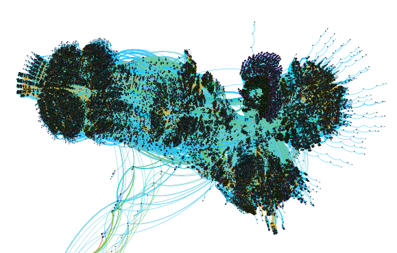
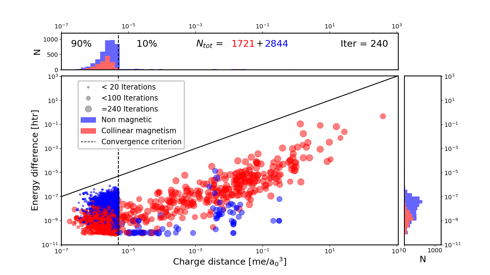
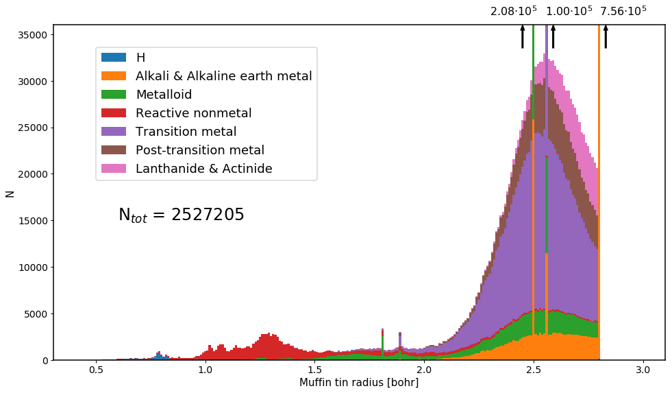

.. fleur_fleur documentation master file, created by
   sphinx-quickstart on Wed Aug 10 10:20:55 2016.
   You can adapt this file completely to your liking, but it should at least
   contain the root `toctree` directive.

Welcome to the `AiiDA-FLEUR`_'s documentation!
##############################################

.. figure:: images/fleur.png
    :width: 25 %
    :align: center
.. figure:: images/MAX-orizz.eps
    :width: 50 %
    :align: center
.. figure:: images/AiiDA_transparent_logo.png
    :width: 50 %
    :align: center

.. _AiiDA: http://www.aiida.net
.. _FLEUR: http://www.flapw.de
.. _AIIDA-FLEUR: https://github.com/broeder-j/aiida-fleur
.. _registry: https://aiidateam.github.io/aiida-registry
.. _OQMD: http://oqmd.org

The aiida-fleur python package enables the use of the all-electron DFT code Fleur (http://www.flapw.de) with the `AiiDA`_ framework (http://www.aiida.net).
This enables Many-task/High-throuput simulations with an all-electron DFT code.
The package contains plugins for the `FLEUR`_ code, inputgenerator and a datastructure. Further it contains basic workflows and utility. 
It is open source under the MIT license and is available under (https://github.com/broeder-j/aiida-fleur). 
The package is developed within the MaX EU Center of Excellence (www.max-center.eu) at Forschungszentrum Jülich GmbH (http://www.fz-juelich.de/pgi/pgi-1/DE/Home/home_node.html), (IAS-1/PGI-1), Germany.
Check out the AiiDA `registry`_ to find out more about what other packages for AiiDA exists, that might be helpful for you.
Further the aiida-fleur package contains AiiDA dependend tools around the workflows and plugins.
All tools independend on aiida-core are moved to the masci-tools repository.

If you use this package please cite:

* for the plugin and workflows: (to be published)
* for fleur: http:/www.flapw.de 

Pictures/Project usage examples:
--------------------------------

Example 1: AiiDA graph visualization of a small database containing about 130 000 nodes
from Fleur calculations

Example 2: Fleur SCF runs on 1362 different Binary systems managed by the scf workchain

  
Example 3: FLAPW muffin tin radii for all materials (>820000) in the `OQMD`_ .

    
Some projects which used aiida-fleur include: ...

Requirements to use this code:
------------------------------

* A running AiiDA version (and postgresql database)
* Executables of the Fleur code

Other packages (in addition to all requirements of AiiDA):

* lxml
* ase
* masci-tools

Installation Instructions:
--------------------------

Install from pypi the latest release::

    $ pip install aiida-fleur

or from the aiida-fleur source folder any branch::

    $ pip install .
    # or which is very useful to keep track of the changes (developers)
    $ pip install -e . 

AiiDA-package Layout:
---------------------

#. Fleur input generator (link)
#. FleurinpData structure (link)
#. Fleur code (link)

The overall plugin for Fleur consists out of three AiiDA plugins. One for the Fleur input generator (inpgen), one datastructure (fleurinpData) representing the inp.xml file and a plugin for the Fleur code (fleur, fleur_MPI). See www.flapw.de.
Other codes from the Fleur family (GFleur) or which build ontop (Spex) are
not supported.

The package also contains workflows

#. Fleur scf
#. Fleur dos
#. Fleur band
#. Fleur eos
#. Fleur initial corelevel shifts
#. Fleur corehole

Further the package contains AiiDA dependend tools around the workflows and plugins.
All tools independend on aiida-core are moved to the masci-tools repository, 
to be available to other non AiiDA related projects and tools.

Acknowledgments:
----------------

We acknowledge partial support from the EU Centre of Excellence “MaX – Materials Design at the Exascale” (http://www.max-centre.eu). (Horizon 2020 EINFRA-5, Grant No. 676598)
We thank the AiiDA team for their help and work. Also the vial exchange with developers of AiiDA packages for other codes was inspireing.

User's Guide
############

Everything you need for using AiiDA-FLEUR

.. toctree::
   :maxdepth: 4

   user_guide/ug_index

  
Developer's Guide
#################

Some things to notice for AiiDA-FLEUR developers.
Conventions, programming style, Integrated testing, things that should not be forgotten

.. toctree::
   :maxdepth: 4

   devel_guide/dg_index

Module reference (API)
######################

Automatic generated documentation for all modules, classes and functions with
reference to the source code. The search is your friend.

.. toctree::
   :maxdepth: 4

   module_guide/mg_index
      

Indices and tables
##################

* :ref:`genindex`
* :ref:`modindex`
* :ref:`search`

