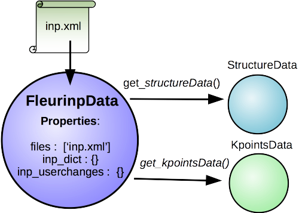

FleurinpData
++++++++++++

Description/Features
--------------------

FleurinpData is a new AiiDA data structure which represents everything a Fleur calculation needs, which is mainly the inp.xml file. 

.. note:: Currently, Fleurinp supports ONLY inp.xml files, which have everything in them (kpoints, energy parameters, ...), i.e which were created with the '-explicit' inpgen command line switch. In general it was designed to account for several separate files too, but this is no yet supported.

FleurinpData was written to make the plug-in user friendlier, hide complexity and ensure the connection to AiiDA data structures (StructureData, KpointsData).
For more detailed information about the methods check the module code documentation (link).

.. note:: For changing the input file use the Fleurinpmodifier class, because a new FleurinpData object has to be stored in the Database which will be linked in the database over a workfunction to the parent FleurinpData.

.. note:: Initialization:

import FleurinpData

F = FleurinpData('path_to_inp.xml_file')
or F = FleurinpData(files=['path_to_inp.xml_file', (some other files)])

Also be aware that the inp.xml file name has to be 'inp.xml', i.e. no file names are changed,
the files will be given with the provided name to Fleur (so far).
Also if you add an other inp.xml file the first one will be overwritten.

Properties
----------

inp_dict : Returns the inp_dict (the representation of the inp.xml file) as it will
        or is stored in the database.

files : Returns the files, which were added to FleurinpData.

_schema_file_path : Returns the absolute path of the xml schema file used for the current inp.xml file.     
        
User Methods
------------

get_file_abs_path('filename') : Returns the absolute path on the disk of a file belonging to FleurinpData. 
del_file('filename') : Deletes a file form FleurinpData.
set_file('path_to_file') : Adds a file to FleurinpData.
set_files(list_of_paths_to_files) : Adds several files to FleurinpData.
get_fleur_modes() : Retrieve information from the inp.xml file. 'Modes' are paths a FLEUR
        calculation can take, resulting in different output files, dependent on the input.
        i.e other files need to be copied before and after the calculation. (used by the parsers)
        common modes are: scf, jspin 2, dos, band, pot8, lda+U, eels, ...
        (Warning, currently not auto supported by the plugin are lda+U, 'magnetism', eels )

(wf) get_structuredata(fleurinp) : Workfunction, which returns an AiiDA Structure Data type extracted from the inp.xml
        file. It this was done before, it returns the existing structure data node (TODO)

(wf) get_kpointsdata(fleurinp) : workfunction,         This routine returns an AiiDA kpoint Data type produced from the inp.xml
        file. This only works if the kpoints are listed in the in inpxml.
(wf) get_parameterdata(fleurinp) : (not implented yet) workfunction that extracts a ParameterData note, which can be an input for inpgen, out of the inp.xml 
(wf) set_kpointsdata(fleurinp, kpointsdata) : This workfunction writes the all the kpoints from a KpointsDataNode in the
        inp.xml file as a kpointslist and return a new FleurinData. It replaces the Kpoints written in the 
        inp.xml file.
        Currently, it is the users resposibility to provide a full
        KpointsDataNode with weights. In the future FLEUR might recalculate them.
        (ans should be moved to FleurinpModifier)

Comments
--------
FleurinpData will serach rekursively for matching Fleur xml schema files in your PYTHONPATH and the current directory.
If you installed the plugin with pip there should be no Problem, otherwise source a folder with the schemafiles in your path. 
If the search takes to long (os.walk) your pythonpath contains many directories, and you should move the plugin dirs to the front of your PYTHONPATH.
'Imergency Hack': add a path to the '_search_paths' variable' 
(In the future there might be a method use_schema, to force the use of a certain schema.)

Fleurinpmodifier
++++++++++++++++

Description
-----------
The Fleurinpmodifier class has to be used if you want to change anything on a Fleurinpdata. It will store and validate all the changes you which to do and produce a new fleurinpdata node after you are done making changes and apply them.

FleurinpDataModifier provides the user with methods to change the Fleur input. (not every possible change is supported, some changes are forbidden, others will be supported in the future). 
In principal the user can do everything, since he could prepare a fleur input himself, and create a FleurinpData object from that input.

Why?
In the open provanence model no data to data links exists and nodes once stored in the database cannot be changed anymore (except extras and comments). Therefore to modify something in the inp.xml file one has to create a new FleurinpData which is not stored, modify it and store it again. But this node would pop unlinked into existence in the database and these would mean we loose the origin from what data it comes from and what was done to it. This is the task of Fleurinpmodifier.

Usage:
------
One creates a Fleurinpmodifier with a FleurinpData object (1). Now the user can perform certain modifications which will be cached and can be previewed(2-3). They will only be applied on a new FleurinpData object when the freeze method is executed(4).
code example

User Methods
------------

General methods:

validate() : Test if the changes in the queue validate
freeze() : Applies all the changes in the queue (calls the workfunction 'modify_fleurinpdata') and returns a new fleurinpdata object
changes() : Displays the current queue of changes
show(display=True, validate=False) :  Test applies the modifications and displayes/prints the resulting inp.xml file.

Change methods:

xml_set_attribv_occ(xpathn, attributename, attribv, occ=[0], create=False) :
xml_set_first_attribv(self, xpathn, attributename, attribv, create=False) :
xml_set_all_attribv(self, xpathn, attributename, attribv, create=False) :
xml_set_text(self, xpathn, text, create=False) :
xml_set_all_text(self, xpathn, text, create=False) :
create_tag(self, xpath, newelement, create=False) :
delete_att(self, xpath, attrib) :
delete_tag(self, xpath) :
replace_tag(self, xpath, newelement) :
set_species(self, species_name, attributedict, create=False) :
set_atomgr_att(self, attributedict, position=None, species=None,create=False) :
#for now
set_inpchanges(self, change_dict) :        
set_nkpts(self, count, gamma='F') :

Node graphs
-----------

1. After any modification was applied to fleurinpData the following nodes will be found in the database to keep the Provenance

2. extract kpoints
3. extract structuredata
4. extract parameterdata(planned)