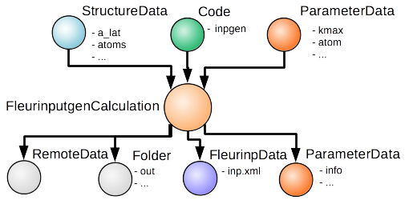

Description
-----------
The input generator plug-in is capable of running the Fleur input generator (inpgen) with all its features, except crystal structure creation (we did not want to support that).
For a calculation it is enough to specify a StructureData node and the code and a FleurinputData object with default parameters, from which one can run a Fleur calculation, will be created.

Supported codes versions
------------------------
* It is tested from Fleur v0.27 (MAX release 1.0) onwards, but it should work
  for all inpgen versions.

Sketch of nodes
---------------

Inputs
------

* **code**, class :py:class:`Code <aiida.orm.Code>`, the Code node of an inpgen executable

* **structure**, class :py:class:`StructureData <aiida.orm.data.structure.StructureData>`, a crystal structure

.. note:: The plugin will run inpgen always with relative coordinates (crystal coordinates) in the 3D case. In the 2D case in rel, rel, abs. Currently for films no crystal rotations are be performed, therefore the coordinates need to be given as Fleur needs them. (x, y in plane, z out of plane)

* **calc_parameters**, class :py:class:`ParameterData <aiida.orm.data.parameter.ParameterData>` (optional)
  Input parameters of inpgen, as a nested dictionary, mapping the fortran list input of inpgen.
  Examples:

  .. literalinclude:: parameter_example.py

  3. with soc
  'soc' : {'theta' : 0.0, 'phi' : 0.0}

.. note:: The ‘&atom’ namelist can occur several times in inpgen input (each key can occur only ones in a python dictionary). The plugin will reconize any namelist which contains the chars ‘atom’.

.. note:: Namelists in the inpgen input without key=value (like &soc) have to be provided with the attributename from the inp.xml.

See the Fleur documentation for the full list of variables and their meaning.
Some keywords don't have to be specified and are already taken care of by AiiDA (are related with the structure or with path to files):
      
defaults:: 

&input film

so far not allowed/supported:: 

&lattice

* **settings**, class :py:class:`ParameterData <aiida.orm.data.parameter.ParameterData>` (optional)
  An optional dictionary that allows the user to specify if aditional files shall be recieved and other advanced non default stuff for inpgen.

Outputs
-------

There are several output nodes that can be created by the inpgen plugin, according to the calculation details.
All output nodes can be accessed with the ``calculation.out`` method.

* **fleurinp** :py:class:`fleurinpData <aiida.orm.data.fleurinp>`
  Data structure which represents the inp.xml file and provides useful methods.
  For more information see fleurinpData. (accessed by ‘’calculation.out.fleurinp’’)
* **output_parameters** :py:class:`ParameterData <aiida.orm.data.parameter.ParameterData>` 
  (accessed by ``calculation.res``)
  (currently empty)
  Should contains information about the inpgen run.
  Example:

  * errors  (possible error messages generated in the run)
  * warnings (possible warning messages generated in the run).
  * recommendations (other hints)
  * output information (some information parsed from the out file)
  
Additional advanced features
----------------------------

While the input link with name 'calc_parameters' is used for the content of the 
namelists and parameters of the inpgen input file, additional parameters for changing the plugin behavior, can be specified in the 'settings' input, also of type ParameterData.

Below we summarise some of the options that you can specify, and their effect.
In each case, after having defined the content of ``settings_dict``, you can use
it as input of a calculation ``calc`` by doing::

  calc.use_settings(ParameterData(dict=settings_dict))

Retrieving more files
.....................

The inpgen plugin retrieves per default the files : inp.xml, out, struct.xsf.

If you know that your inpgen calculation is producing additional files that you want to
retrieve (and preserve in the AiiDA repository in the long term), you can add
those files as a list as follows (here in the case of a file named
``testfile.txt``)::

  settings_dict = {  
    'additional_retrieve_list': ['testfile.txt'],
  }

Retrieving less files
.....................

If you know that you do not want to retrieve certain files (and preserve in the AiiDA repository in the long term) you can add those files as a list as follows (here in the case of a file named
``testfile.txt``)::

  settings_dict = {  
    'remove_from_retrieve_list': ['testfile.txt'],
  }
