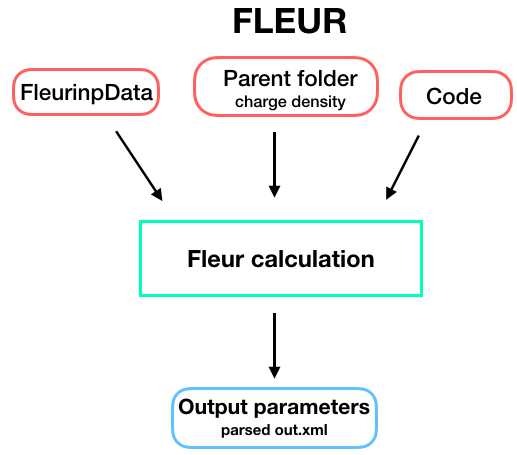

.. _fleurcode_plugin:

FLEUR code plugin
=================

Description
'''''''''''
The :py:class:`~aiida_fleur.calculation.fleur.FleurCalculation` runs Fleur executable e.g.
``fleur`` or ``fleur_MPI``.

Inputs
''''''

To set up an input dictionary, consider using
:py:func:`~aiida_fleur.tools.common_fleur_wf.get_inputs_fleur()` which assembles input nodes
in a ready-to-use single dictionary.

The table below shows all possible inputs for the FleurCalculation:

+------------------+--------------+--------------------------------------+----------+
| name             | type         | description                          | required |
+==================+==============+======================================+==========+
| code             | Code         | Fleur code                           | yes      |
+------------------+--------------+--------------------------------------+----------+
| fleurinp         | FleurinpData | Object representing inp.xml          | no       |
+------------------+--------------+--------------------------------------+----------+
| parent_folder    | RemoteData   | Remote folder of another calculation | no       |
+------------------+--------------+--------------------------------------+----------+
| settings         | Dict         | special settings                     | no       |
+------------------+--------------+--------------------------------------+----------+
| metadata.options | Dict         | computational resources              | yes      |
+------------------+--------------+--------------------------------------+----------+

* **fleurinp**: :py:class:`~aiida_fleur.data.fleurinp.FleurinpData`, optional -
  Data structure which represents the inp.xml file and everything a Fleur calculation needs.
  For more information see :ref:`FleurinpData <fleurinp_data>`.
* **parent_folder**: :py:class:`~aiida.orm.RemoteData`, optional -
  If specified, certain files in the previous Fleur calculation folder are
  copied in the new calculation folder.

.. note::
        **fleurinp** and **parent_folder** are both optional. Depending
        on the setup of the inputs, one of five scenarios will happen:

          1. **fleurinp**: files belonging to **fleurinp** will be used as input for
             FLEUR calculation.
          2. **fleurinp** + **parent_folder** (FLEUR): files, given in **fleurinp**
             will be used as input for FLEUR calculation. Moreover, initial charge density will be
             copied from the folder of the parent calculation.
          3. **parent_folder** (FLEUR): Copies inp.xml file and initial
             charge density from the folder of the parent FLEUR calculation.
          4. **parent_folder** (input generator): Copies inp.xml file
             from the folder of the parent inpgen calculation.
          5. **parent_folder** (input generator) + **fleurinp**: files belonging to
             **fleurinp** will be used as input for FLEUR calculation. Remote folder is ignored.

Outputs
'''''''
The table below shows all the output nodes generated by
:py:class:`~aiida_fleur.calculation.fleur.FleurCalculation`:

+------------------+---------------+-------------------------------+
| name             | type          | comment                       |
+==================+===============+===============================+
| output_parameters| Dict          | contains parsed `out.xml`     |
+------------------+---------------+-------------------------------+
| remote_folder    | FolderData    | represents calculation folder |
+------------------+---------------+-------------------------------+
| retrieved        | FolderData    | represents retrieved folder   |
+------------------+---------------+-------------------------------+

All the outputs can be found in ``calculation.outputs``.

* **remote_folder**: :py:class:`~aiida.orm.RemoteData` -
  RemoteData which represents the calculation folder on the remote machine.

* **retrieved**: :py:class:`~aiida.orm.FolderData` -
  FolderData which represents the retrieved folder on the remote machine.

* **output_parameters**: :py:class:`~aiida.orm.Dict` -
  Contains all kinds of information of the calculation
  and some physical quantities of the last iteration.

  An example output node:

    .. literalinclude:: output_node_example.py

.. .. note::
..           The 'simple' output node will evolve. A draft of a second complex output node which
..           contains informations of all iterations and atomtypes exists, but a dictionary is not
..           the optimal structure for this. For now this is postponed. In any case if you want to
..           parse something from the out.xml checkout the methods in the `masci-tools` libary.

Errors
''''''

Errors of the parsing are reported in the log of the calculation (accessible
with the ``verdi process report`` command).
Everything that Fleur writes into stderr is also shown here, i.e all JuDFT error messages.
Example:

.. code-block:: bash

      (aiidapy)% verdi process report 513
      *** 513 [scf: fleur run 1]: None
      *** (empty scheduler output file)
      *** (empty scheduler errors file)
      *** 3 LOG MESSAGES:
      +-> ERROR at 2019-07-17 14:57:01.108964+00:00
      | parser returned exit code<302>: FLEUR calculation failed.
      +-> ERROR at 2019-07-17 14:57:01.097337+00:00
      | FLEUR calculation did not finishsuccessfully.
      +-> WARNING at 2019-07-17 14:57:01.056220+00:00
      | The following was written into std error and piped to out.error :
      |  I/O warning : failed to load external entity "relax.xml"
      | rm: cannot remove ‘cdn_last.hdf’: No such file or directory
      | **************juDFT-Error*****************
      | Error message:e>vz0
      | Error occurred in subroutine:vacuz
      | Hint:Vacuum energy parameter too high
      | Error from PE:0/24

Moreover, all warnings and errors written by Fleur in the out.xml file are stored in the
ParameterData under the key ``warnings``, and are accessible with ``Calculation.res.warnings``.

More serious FLEUR calculation failures generate a non-zero :ref:`exit code<exit_codes>`.
Each exit code has it's own reason:

+-----------+--------------------------------------------------------------+
| Exit code | Reason                                                       |
+===========+==============================================================+
| 300       | One of output files can not be opened                        |
+-----------+--------------------------------------------------------------+
| 301       | No retrieved folder found                                    |
+-----------+--------------------------------------------------------------+
| 302       | FLEUR calculation failed for unknown reason                  |
+-----------+--------------------------------------------------------------+
| 303       | XML output file was not found                                |
+-----------+--------------------------------------------------------------+
| 304       | Parsing of XML output file failed                            |
+-----------+--------------------------------------------------------------+
| 305       | Parsing of relax XML output file failed                      |
+-----------+--------------------------------------------------------------+
| 310       | FLEUR calculation failed due to memory issue                 |
+-----------+--------------------------------------------------------------+
| 311       | FLEUR calculation failed because atoms spilled to the vacuum |
+-----------+--------------------------------------------------------------+
| 312       | FLEUR calculation failed due to MT overlap                   |
+-----------+--------------------------------------------------------------+
| 313       | FLEUR calculation failed due to MT overlap during relaxation |
+-----------+--------------------------------------------------------------+
| 314       | Problem with cdn is suspected                                |
+-----------+--------------------------------------------------------------+
| 315       | Invalid Elements found in the LDA+U density matrix.          |
+-----------+--------------------------------------------------------------+
| 316       | Calculation failed due to time limits.                       |
+-----------+--------------------------------------------------------------+

.. _fleur_parallelization:

Parallelization options
''''''''''''''''''''''''

For parallel FLEUR calculations the input under ``metadata.options`` can be used.
In higher level workchains this input might be present as a plain ``options`` input,
but it is completely equivalent to the ``metadata.options`` input.

.. code-block:: python

    inputs.metadata.options = {
      'resources': {
        'num_machines': 2, #Number of computing nodes
        'num_mpiprocs_per_machine': 4, #Number of MPI processes per node
        'num_cpus_per_mpiproc': 12, #Number of OMP threads per MPI process
      },
      'withmpi': True, #This flag makes sure that the process is submitted using MPI
      'max_wallclock_seconds': 3600, #Maximum wallclock time in seconds
    }

This will result in setting the following slurm Parallelization variables in the submit script.

.. code-block:: bash

  #SBATCH --nodes=1
  #SBATCH --ntasks-per-node=6
  #SBATCH --cpus-per-task=8
  #SBATCH --time=01:00:00
  #... Further configuration options unrelated to parallelization...

  'srun' '/path/to/fleur/' '<further FLEUR cmdline flags, e.g. -last_extra>'

Note, that the ``srun`` command is computer specific and is configured in ``verdi computer setup``
with the ``Mpirun command`` option.

.. _Fleur_settings:

Additional advanced features
''''''''''''''''''''''''''''

.. _documentation: www.flapw.de

In general see the FLEUR `documentation`_.

While the input link with name **fleurinp** is used for the content of the
inp.xml, additional parameters for changing the plugin behavior, can be specified in the
**settings** input, also of type :py:class:`~aiida.orm.Dict`.

Below we summarise some of the options that you can specify, and their effect.
In each case, after having defined the content of ``settings_dict``, you can use
it as input of a calculation ``calc`` by doing::

  calc.use_settings(Dict(dict=settings_dict))

Adding command-line options
...........................

If you want to add command-line options to the executable (particularly
relevant e.g. '-hdf' use hdf, or '-magma' use different libraries, magma in this case),
you can pass each option
as a string in a list, as follows::

  settings_dict = {
      'cmdline': ['-hdf', '-magma'],
  }

The default command-line of a fleur execution of the plugin looks like this for the torque
scheduler::

'mpirun' '-np' 'XX' 'path_to_fleur_executable' '-wtime' 'XXX' < 'inp.xml' > 'shell.out' 2> 'out.error'

If the code node description contains 'hdf5' in some form, the plugin will use per default hdf5,
it will only copy the last hdf5 density back, not the full cdn.hdf file.
The Fleur execution line becomes in this case::

'mpirun' '-np' 'XX' 'path_to_fleur_executable' '-last_extra' '-wtime' 'XXX' < 'inp.xml' > 'shell.out' 2> 'out.error'

Retrieving more files
.....................

AiiDA-FLEUR does not copy all output files generated by a FLEUR calculation. By default, the plugin
copies only ``out.xml``, ``cdn1`` and ``inp.xml`` and other technical files.
Depending on certain switches in used ``inp.xml``, the plugin
is capable of automatically adding additional files to the copy list:

  * if ``band=T`` : ``bands.1``, ``bands.2``
  * if ``dos=T`` : ``DOS.1``, ``DOS.2``
  * if ``pot8=T`` : ``pot*``
  * if ``l_f=T`` : ``relax.xml``

If you know that your calculation is producing additional files that you want to
retrieve (and preserve in the AiiDA repository in the long term), you can add
those files as a list as follows (here in the case of a file named
``testfile.txt``)::

  settings_dict = {
    'additional_retrieve_list': ['testfile.txt'],
  }

Retrieving less files
.....................

If you know that you do not want to retrieve certain files(and preserve in the AiiDA repository
in the long term). i.e. the ``cdn1`` file is to large and it is stored somewhere else anyway,
you can add those files as a list as follows (here in the case of a file named
``testfile.txt``)::

  settings_dict = {
    'remove_from_retrieve_list': ['testfile.txt'],
  }

Copy more files remotely
........................

The plugin copies by default the ``mixing_history*`` files if a parent_folder is given
in the input.

If you know that for your calculation you need some other files on the remote machine, you can add
those files as a list as follows (here in the case of a file named
``testfile.txt``)::

  settings_dict = {
    'additional_remotecopy_list': ['testfile.txt'],
  }

Copy less files remotely
........................

If you know that for your calculation do not need some files which are copied per default by
the plugin you can add those files as a list as follows (here in the case of a file named
``testfile.txt``)::

  settings_dict = {
    'remove_from_remotecopy_list': ['testfile.txt'],
  }
