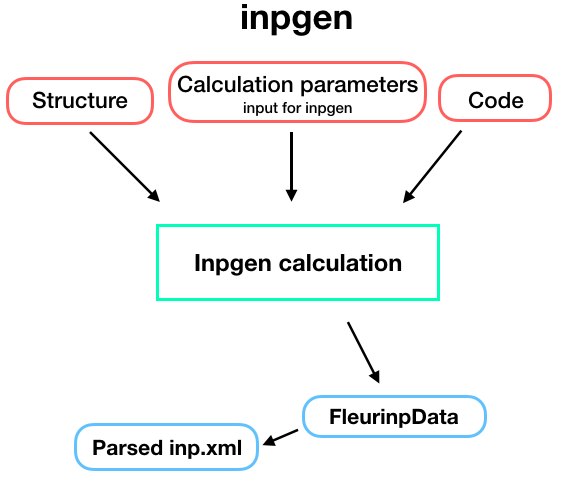

.. _inpgen_plugin:

Fleur input generator plugin
============================

.. _Fleur documentation: https://www.flapw.de/site/inpgen/#basic-input

Description
'''''''''''

The input generator plugin is capable of running the Fleur input generator (inpgen).
Similarly to inpgen code,
:py:class:`~aiida_fleur.calculation.fleurinputgen.FleurinputgenCalculation` accepts
a :py:class:`~aiida.orm.StructureData` and a list of other parameters via
**calc_parameters** (:py:class:`~aiida.orm.Dict` type)
containing all other parameters that inpgen accepts as an input.
As a result, an :py:class:`~aiida_fleur.data.fleurinp.FleurinpData` node
will be created which is a database representation of inp.xml and all other input files for FLEUR.

To set up an input dictionary, consider using
:py:func:`~aiida_fleur.tools.common_fleur_wf.get_inputs_inpgen()` which assembles input nodes
in a ready-to-use single dictionary.

Inputs
''''''
The table below shows all the input nodes that can be passed into additional
:py:class:`~aiida_fleur.calculation.fleurinputgen.FleurinputgenCalculation`:

+----------------------+---------------+-------------------------+----------+
| name                 | type          | description             | required |
+======================+===============+=========================+==========+
| code                 | Code          | Inpgen code             | yes      |
+----------------------+---------------+-------------------------+----------+
| structure            | StructureData | Structure data node     | yes      |
+----------------------+---------------+-------------------------+----------+
| parameters           | Dict          | FLAPW parameters        | no       |
+----------------------+---------------+-------------------------+----------+
| metadata.options     | Dict          | computational resources | yes      |
+----------------------+---------------+-------------------------+----------+
| metadata.label       | string        | computational resources | yes      |
+----------------------+---------------+-------------------------+----------+
| metadata.description | string        | computational resources | yes      |
+----------------------+---------------+-------------------------+----------+

* **code**: :py:class:`Code <aiida.orm.Code>` - the Code node of an inpgen executable

* **structure**: :py:class:`~aiida.orm.StructureData` -
  a crystal structure that will be written into simplified input file. The plugin will run inpgen
  always with relative coordinates (crystal coordinates) in the
  3D case. In the 2D case in rel, rel, abs. Currently for films no crystal rotations are be
  performed, therefore the coordinates need to be given as Fleur needs them. (x, y in plane,
  z out of plane)

* **calc_parameters**: :py:class:`Dict <aiida.orm.Dict>`, optional -
  Input parameters of inpgen as a nested dictionary.
  An example:

  .. literalinclude:: parameter_example.py

  The list of all possible keys:

  .. code-block:: python

      'input': ['film', 'cartesian', 'cal_symm', 'checkinp', 'symor', 'oldfleur']

      'atom': ['id', 'z', 'rmt', 'dx', 'jri', 'lmax', 'lnonsph', 'ncst', 'econfig',
               'bmu', 'lo', 'element', 'name']

      'comp': ['jspins', 'frcor', 'ctail', 'kcrel', 'gmax', 'gmaxxc', 'kmax']

      'exco': ['xctyp', 'relxc'],

      'film': ['dvac', 'dtild'],

      'soc': ['theta', 'phi'],

      'qss': ['x', 'y', 'z'],

      'kpt': ['nkpt', 'kpts', 'div1', 'div2', 'div3','tkb', 'tria'],

      'title': {}

  See the `Fleur documentation`_ for the meaning of each key.

  The `atom` namelist can occur several times in the parameter dictionary representing different
  atom species. However, python does not accept the same key twice and one must use `atomN` keys
  where `N` is an integer which will be ignored during the simplified input generation.
  Note that there is no need to set `&input film` because it is set automatically according to
  the given **structure** input node. That is also the reason why `&lattice` input parameter is
  ignored, we only support setting structure via **structure** input node.

* **settings**: class :py:class:`Dict <aiida.orm.Dict>`, optional -
  An optional dictionary that allows the user to specify if additional files shall be received and
  other advanced non default stuff for inpgen.

To set up an input dictionary, consider using
:py:func:`~aiida_fleur.tools.common_fleur_wf.get_inputs_inpgen()` which assembles input nodes
in a ready-to-use single dictionary.

Outputs
'''''''
The table below shows all the output nodes generated by
:py:class:`~aiida_fleur.calculation.fleurinputgen.FleurinputgenCalculation`:

+------------------+---------------+-------------------------------+
| name             | type          | comment                       |
+==================+===============+===============================+
| fleurinp         | FleurinpData  | represents `inp.xml`          |
+------------------+---------------+-------------------------------+
| remote_folder    | FolderData    | represents calculation folder |
+------------------+---------------+-------------------------------+
| retrieved        | FolderData    | represents retrieved folder   |
+------------------+---------------+-------------------------------+

All output nodes can be accessed via ``calculation.outputs``.

* **fleurinp**: :py:class:`~aiida_fleur.data.fleurinp.FleurinpData` -
  Data structure which represents the inp.xml file and provides useful methods.
  For more information see :ref:`fleurinp_data`
* **remote_folder**: :py:class:`~aiida.orm.RemoteData` -
  RemoteData which represents the calculation folder on the remote machine.
* **retrieved**: :py:class:`~aiida.orm.FolderData` -
  FolderData which represents the retrieved folder on the remote machine.

.. * **output_parameters**: :py:class:`Dict <aiida.orm.Dict>` -
..   Should contain information about the inpgen run.
..   Example:

..   * errors  (possible error messages generated in the run)
..   * warnings (possible warning messages generated in the run).
..   * recommendations (other hints)
..   * output information (some information parsed from the out file)

Errors
'''''''
When a certain error appears, the calculation finishes with a non-zero :ref:`exit code<exit_codes>`.

+-----------+--------------------------------------------------+
| Exit code | Reason                                           |
+===========+==================================================+
| 251       | Input parameters for inpgen contain unknown keys |
+-----------+--------------------------------------------------+
| 253       | Fleur lattice needs atom positions as input      |
+-----------+--------------------------------------------------+
| 254       | Excessive input parameters were specified        |
+-----------+--------------------------------------------------+
| 300       | No retrieved folder found                        |
+-----------+--------------------------------------------------+
| 301       | One of the output files can not be opened        |
+-----------+--------------------------------------------------+
| 306       | XML input file was not found                     |
+-----------+--------------------------------------------------+
| 307       | Some required files were not retrieved           |
+-----------+--------------------------------------------------+

Additional advanced features
''''''''''''''''''''''''''''

While the input link with name ``calc_parameters`` is used for the content of the
namelists and parameters of the inpgen input file, additional parameters for changing the plugin
behavior can be specified in the 'settings': class :py:class:`Dict <aiida.orm.Dict>` input.

Below we summarise some of the options that you can specify and their effect.
In each case, after having defined the content of ``settings_dict``, you can use
it as input of a calculation ``calc`` by doing::

  calc.use_settings(Dict(dict=settings_dict))

Retrieving more files
.....................

The inpgen plugin retrieves per default the files : inp.xml, out, struct.xsf.

If you know that your inpgen calculation is producing additional files that you want to
retrieve (and preserve in the AiiDA repository in the long term), you can add
those files as a list as follows (here in the case of a file named
``testfile.txt``)::

  settings_dict = {
    'additional_retrieve_list': ['testfile.txt'],
  }

Retrieving less files
.....................

If you know that you do not want to retrieve certain files (and preserve in the AiiDA repository
in the long term) you can add those files as a list as follows (here in the case of a file named
``testfile.txt``)::

  settings_dict = {
    'remove_from_retrieve_list': ['testfile.txt'],
  }
