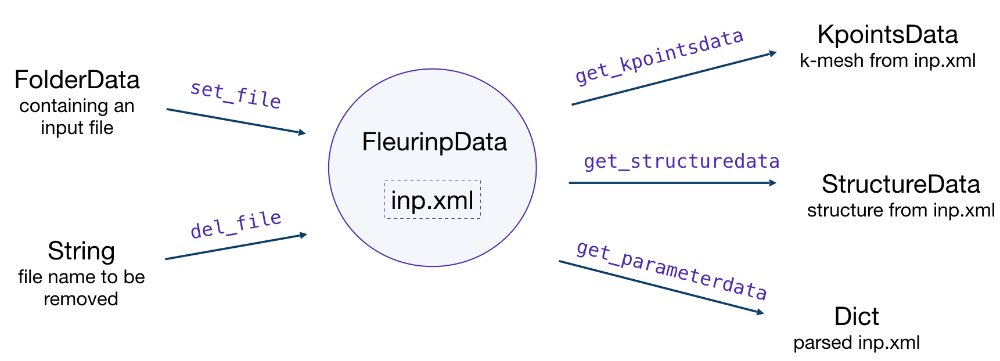

.. _fleurinp_data:

FleurinpData
============

* **Class**: :py:class:`~aiida_fleur.data.fleurinp.FleurinpData`
* **String to pass to the** :py:func:`~aiida.plugins.DataFactory`: ``fleur.fleurinp``
* **Aim**: store input files for the FLEUR code and provide user-friendly editing.
* **What is stored in the database**: the filenames, a parsed inp.xml files as nested dictionary
* **What is stored in the file repository**: inp.xml file and other optional files.
* **Additional functionality**: Provide user-friendly methods. Connected to structure and Kpoints
  AiiDA data structures

Description/Features
--------------------

..    :height: 300px

:py:class:`~aiida_fleur.data.fleurinp.FleurinpData` is an additional AiiDA data structure which
represents everything a :py:class:`~aiida_fleur.calculation.fleur.FleurCalculation`
needs, which is mainly a complete ``inp.xml`` file.

.. note::

          Currently, :py:class:`~aiida_fleur.data.fleurinp.FleurinpData` methods support
          *ONLY* ``inp.xml`` files, which have
          everything in them (kpoints, energy parameters, ...), i.e which were created with
          the ``-explicit`` inpgen command line switch.
          In general it was designed to account for several separate files too,
          but this is no the default way Fleur should be used with AiiDA.

:py:class:`~aiida_fleur.data.fleurinp.FleurinpData` was implemented
to make the plugin more user-friendly, hide complexity and
ensure the connection to AiiDA data structures (:py:class:`~aiida.orm.StructureData`,
:py:class:`~aiida.orm.KpointsData`).
More detailed information about the methods can be found below and in the module code documentation.

.. note::

          If you want to change the input file use the
          :py:class:`~aiida_fleur.data.fleurinpmodifier.FleurinpModifier` (:ref:`fleurinp_mod`)
          class, because a :py:class:`~aiida_fleur.data.fleurinp.FleurinpData` object
          has to be stored in the database and usually sealed.

Initialization:

.. code-block:: python

  from aiida_fleur.data.fleurinp import FleurinpData
  # or FleurinpData = DataFactory('fleur.fleurinp')

  F = FleurinpData(files=['path_to_inp.xml_file', <other files>])
  # or
  F = FleurinpData(files=['inp.xml', <other files>], node=<folder_data_pk>)

If the ``node`` attribute is specified, AiiDA will try to get files from the
:py:class:`~aiida.orm.FolderData` corresponding
to the node. If not, it tries to find an ``inp.xml`` file using an absolute path
``path_to_inp.xml_file``.

Be aware that the ``inp.xml`` file name has to be named 'inp.xml', i.e. no file names are
changed because the filenames will not be changed before submitting a Fleur Calculation.
If you add another inp.xml file the first one will be overwritten.

Properties
----------

    * :py:exc:`~aiida_fleur.data.fleurinp.FleurinpData.inp_dict`: Returns the
      inp_dict (the representation of the inp.xml file) as it will or is
      stored in the database.

    * :py:exc:`~aiida_fleur.data.fleurinp.FleurinpData.files`: Returns a list of files,
      which were added to FleurinpData. Note that all of these
      files will be copied to the folder where FLEUR will be run.

    * :py:exc:`~aiida_fleur.data.fleurinp.FleurinpData.inp_version`: Returns the version of the stored ``inp.xml``

    * :py:exc:`~aiida_fleur.data.fleurinp.FleurinpData.parser_info`: Returns errors, warnings and information encountered while constructing the :py:exc:`~aiida_fleur.data.fleurinp.FleurinpData.inp_dict` from the ``inp.xml``

.. note::
  :py:class:`~aiida_fleur.data.fleurinp.FleurinpData` will use the ``masci-tools`` library to parse the ``inp.xml``. This library contains the schema files for the fleur input and output XML files for many of the fleur releases starting from version ``0.27``. If a version is encountered that is not yet stored in the installed version of the ``masci-tools`` library, the latest available version is used.

User Methods
------------

    * :py:func:`~aiida_fleur.data.fleurinp.FleurinpData.del_file()` - Deletes a file from
      :py:class:`~aiida_fleur.data.fleurinp.FleurinpData` instance.
    * :py:func:`~aiida_fleur.data.fleurinp.FleurinpData.set_file()` - Adds a file from a folder node
      to :py:class:`~aiida_fleur.data.fleurinp.FleurinpData` instance.
    * :py:func:`~aiida_fleur.data.fleurinp.FleurinpData.set_files()` - Adds several files from a
      folder node to :py:class:`~aiida_fleur.data.fleurinp.FleurinpData` instance.
    * :py:func:`~aiida_fleur.data.fleurinp.FleurinpData.get_fleur_modes()` - Analyses the inp.xml and
      get a  dictionary with the corresponding calculation modes (Noco, SOC, ...)
    * :py:func:`~aiida_fleur.data.fleurinp.FleurinpData.get_structuredata()` - A CalcFunction which
      returns an AiiDA :py:class:`~aiida.orm.StructureData`
      type extracted from the inp.xml file.
    * :py:func:`~aiida_fleur.data.fleurinp.FleurinpData.get_kpointsdata()` - A CalcFunction which
      returns an AiiDA :py:class:`~aiida.orm.KpointsData`
      type produced from the inp.xml. If multiple k-point sets are defined (Fleur release MaX5 or later) a dictionary of :py:class:`~aiida.orm.KpointsData` types is returned
      file. This only works if the kpoints are listed in the in inp.xml.
    * :py:func:`~aiida_fleur.data.fleurinp.FleurinpData.get_parameterdata()` - A CalcFunction
      that extracts a :py:class:`~aiida.orm.Dict` node
      containing FLAPW parameters. This node can be used as an input for inpgen.

.. _setting_labels:

Setting up atom labels
----------------------

Label is a string that marks a certain atom in the ``inp.xml`` file. Labels are created automatically
by the inpgen, however, in some cases it is helpful to control atom labeling. This can be done by
setting up the kind name while initialising the structure:

.. code-block:: python

  structure = StructureData(cell=cell)
  structure.append_atom(position=(0.0, 0.0, -z), symbols='Fe', name='Fe123')
  structure.append_atom(position=(x, y, 0.0), symbols='Pt')
  structure.append_atom(position=(0., 0., z), symbols='Pt')

in this case both of the Pr atoms will get default labels, but 'Fe' atom will the label '123'
(actually '                 123', but all of the methods in AiiDA-Fleur are implemented in a way
that user should know only last digit characters).

.. note::

  Kind name, which is used for labeling, must begin from the element name and end up with a number.
  It is **very important** that the first digit of the number is smaller than 4: ``152``, ``3``, ``21``
  can be good choices, when ``492``, ``66``, ``91`` are forbidden.

.. warning::

  Except setting up the label, providing a kind name also creates a new specie. This is because
  the ``123`` will not only appear as a label, but also in the atom number. In our case, the line
  in the inpgen input corresponding to Fe atom will look like ``26.123 0 0 -z 123``. Hence,
  if we would have another Fe atom with the default kind name, both of the Fe atom would belong
  to different atom group, generally resulting in lower symmetry.

Given labels can be used for simplified xml methods. For example,
when one performs SOC calculations it might be needed to vary ``socscale`` parameter for a certain
atom. Knowing the correct label of the atom, it is straightforward to make such a change in
:class:`~aiida_fleur.data.fleurinp.FleurinpData` object
(:ref:`using <modify_methods>` the :class:`~aiida_fleur.data.fleurinpmodifier.FleurinpModifier`)
or pass a corresponding
line to ``inpxml_changes`` of workchain parameters:

.. code-block:: python

  # an example of inpxml_changes list, that sets socscale of the iron atom
  # from the above structure to zero
  inpxml_changes = [('set_species_label', {'at_label': '123',
                                          'attributedict': {
                                              'special': {'socscale': 0.0}
                                              },
                                          'create': True
                                         })]

  # in this example the atomgroup, to which the atom with label '222' belongs,
  # will be modified
  fm = FleurinpModifier(SomeFleurinp)
  fm.set_atomgroup_label({'force': {'relaxXYZ': 'FFF'}, atom_label='                 222')
