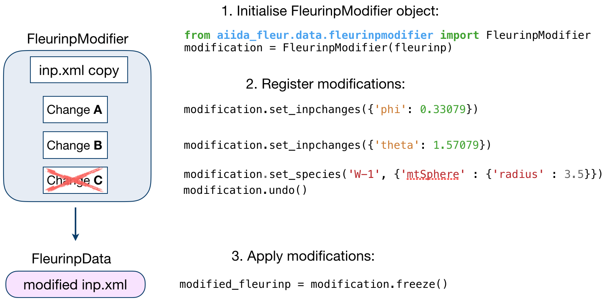
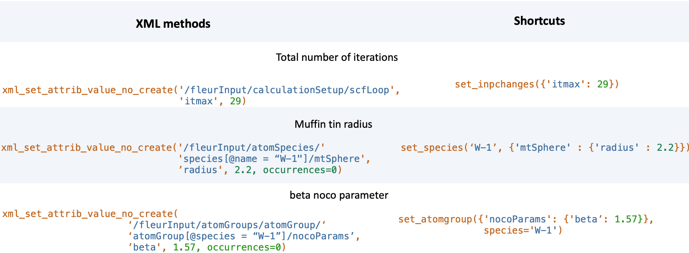

.. _fleurinp_mod:

FleurinpModifier
================

.. contents::

Description
-----------
The :py:class:`~aiida_fleur.data.fleurinpmodifier.FleurinpModifier` class has
to be used if you want to change anything in a stored
:py:class:`~aiida_fleur.data.fleurinp.FleurinpData`.
It will store and validate all the changes you wish to do and produce a new
:py:class:`~aiida_fleur.data.fleurinp.FleurinpData` node
after you are done making changes and apply them.

:py:class:`~aiida_fleur.data.fleurinpmodifier.FleurinpModifier` provides a
user with methods to change the Fleur input.
In principle a user can do everything, since he could prepare a FLEUR input himself and create a
:py:class:`~aiida_fleur.data.fleurinp.FleurinpData` object from that input.

.. note::
    In the open provenance model nodes stored in the database
    cannot be changed (except extras and comments). Therefore, to modify something in a stored
    `inp.xml` file one has to create a new :py:class:`~aiida_fleur.data.fleurinp.FleurinpData`
    which is not stored, modify it and store it
    again. However, this node would pop into existence unlinked in the database and this would mean
    we loose the origin from what data it comes from and what was done to it. This is the task of
    :py:class:`~aiida_fleur.data.fleurinpmodifier.FleurinpModifier`.

Usage
------
To modify an existing :py:class:`~aiida_fleur.data.fleurinp.FleurinpData`, a
:py:class:`~aiida_fleur.data.fleurinpmodifier.FleurinpModifier` instance
has to be initialised staring from the
:py:class:`~aiida_fleur.data.fleurinp.FleurinpData` instance.
After that, a user should register
certain modifications which will be cached and can be previewed. They will be applied on
a new :py:class:`~aiida_fleur.data.fleurinp.FleurinpData`
object when the freeze method is executed. A code example:

.. code-block:: python

  from aiida_fleur.data.fleurinpmodifier import FleurinpModifier

  F = FleurinpData(files=['inp.xml'])
  fm = FleurinpModifier(F)                                # Initialise FleurinpModifier class
  fm.set_inpchanges({'dos' : True, 'Kmax': 3.9 })         # Add changes
  fm.show()                                               # Preview
  new_fleurinpdata = fm.freeze()                          # Apply

The figure below illustrates the work of the
:py:class:`~aiida_fleur.data.fleurinpmodifier.FleurinpModifier` class.

User Methods
------------

General methods
_______________

    * :py:func:`~aiida_fleur.data.fleurinpmodifier.FleurinpModifier.validate()`: Tests if
      the changes in the given list are validated.
    * :py:func:`~aiida_fleur.data.fleurinpmodifier.FleurinpModifier.freeze()`: Applies all the
      changes in the list, calls
      :py:func:`~aiida_fleur.data.fleurinpmodifier.modify_fleurinpdata()` and
      returns a new :py:class:`~aiida_fleur.data.fleurinp.FleurinpData` object.
    * :py:func:`~aiida_fleur.data.fleurinpmodifier.FleurinpModifier.changes()`: Displays the
      current list of changes.
    * :py:func:`~aiida_fleur.data.fleurinpmodifier.FleurinpModifier.undo()`: Remove the last registered change or all registered changes
    * :py:func:`~aiida_fleur.data.fleurinpmodifier.FleurinpModifier.show()`:  Applies
      the modifications and displays/prints the resulting ``inp.xml`` file. Does not generate a new
      :py:class:`~aiida_fleur.data.fleurinp.FleurinpData` object.

.. _modify_methods:

Modification registration methods
_________________________________
The registration methods can be separated into three groups. First of all,
there are XML methods that require deeper knowledge about the structure of an ``inp.xml`` file.
All of them require an xpath input:

    * :py:func:`~aiida_fleur.data.fleurinpmodifier.FleurinpModifier.xml_set_attrib_value_no_create()`: Set an
      attribute on the specified xml elements to the specified value(s). The ``occurrences`` argument can be used to select, which occurences to modify
    * :py:func:`~aiida_fleur.data.fleurinpmodifier.FleurinpModifier.xml_set_text_no_create()`: Set the
      text on the specified xml elements to the specified value(s). The ``occurrences`` argument can be used to select, which occurences to modify
    * :py:func:`~aiida_fleur.data.fleurinpmodifier.FleurinpModifier.xml_create_tag()`: Insert
      an xml element in the xml tree.
    * :py:func:`~aiida_fleur.data.fleurinpmodifier.FleurinpModifier.xml_replace_tag()`: Replace
      an xml element in the xml tree.
    * :py:func:`~aiida_fleur.data.fleurinpmodifier.FleurinpModifier.xml_delete_tag()`: Delete
      an xml element in the xml tree.
    * :py:func:`~aiida_fleur.data.fleurinpmodifier.FleurinpModifier.xml_delete_att()`: Delete an attribute on
      a xml element in the xml tree.

On the other hand, there are shortcut methods that already know some paths:

    * :py:func:`~aiida_fleur.data.fleurinpmodifier.FleurinpModifier.set_species()`: Specific
      user-friendly method to change species parameters.
    * :py:func:`~aiida_fleur.data.fleurinpmodifier.FleurinpModifier.set_atomgroup()`:  Specific
      method to change atom group parameters.
    * :py:func:`~aiida_fleur.data.fleurinpmodifier.FleurinpModifier.set_species_label()`: Specific
      user-friendly method to change a specie of an atom with a certain label.
    * :py:func:`~aiida_fleur.data.fleurinpmodifier.FleurinpModifier.set_atomgroup_label()`:  Specific
      method to change atom group parameters of an atom with a certain label.
    * :py:func:`~aiida_fleur.data.fleurinpmodifier.FleurinpModifier.set_inpchanges()`: Specific
      user-friendly method for easy changes of attribute key value type.
    * :py:func:`~aiida_fleur.data.fleurinpmodifier.FleurinpModifier.shift_value()`: Specific
      user-friendly method to shift value of an attribute.
    * :py:func:`~aiida_fleur.data.fleurinpmodifier.FleurinpModifier.shift_value_species_label()`: Specific
      user-friendly method to shift value of an attribute of an atom with a certain label.
    * :py:func:`~aiida_fleur.data.fleurinpmodifier.FleurinpModifier.set_nkpts()`: Specific
      method to set the number of kpoints. **(Only for Max4 and earlier)**
    * :py:func:`~aiida_fleur.data.fleurinpmodifier.FleurinpModifier.set_kpath()`: Specific
      method to set a kpoint path for bandstructures **(Only for Max4 and earlier)**
    * :py:func:`~aiida_fleur.data.fleurinpmodifier.FleurinpModifier.set_kpointlist()`: Specific
      method to set the used kpoints via a array of coordinates and weights
    * :py:func:`~aiida_fleur.data.fleurinpmodifier.FleurinpModifier.set_kpointsdata()` -
      User-friendly method used to writes kpoints
      of a :py:class:`~aiida.orm.KpointsData` node to the
      inp.xml file. It replaces old kpoints for MaX4 versions and older. for MaX5 and later the kpoints are entered as a new kpoint list
    * :py:func:`~aiida_fleur.data.fleurinpmodifier.FleurinpModifier.switch_kpointset()`: Specific
      method to switch the used kpoint set. **(Only for Max5 and later)**
    * :py:func:`~aiida_fleur.data.fleurinpmodifier.FleurinpModifier.set_attrib_value()`: user-friendly method for setting attributes in the xml file by specifying their name
    * :py:func:`~aiida_fleur.data.fleurinpmodifier.FleurinpModifier.set_first_attrib_value()`: user-friendly method for setting the first occurrence of an attribute in the xml file by specifying its name
    * :py:func:`~aiida_fleur.data.fleurinpmodifier.FleurinpModifier.add_number_to_attrib()`: user-friendly method for adding to or multiplying values of attributes in the xml file by specifying their name
    * :py:func:`~aiida_fleur.data.fleurinpmodifier.FleurinpModifier.add_number_to_first_attrib()`: user-friendly method for adding to or multiplying values of the first occurrence of the attribute in the xml file by specifying their name
    * :py:func:`~aiida_fleur.data.fleurinpmodifier.FleurinpModifier.set_text()`: user-friendly method for setting text on xml elements in the xml file by specifying their name
    * :py:func:`~aiida_fleur.data.fleurinpmodifier.FleurinpModifier.set_first_text()`: user-friendly method for setting the text on the first occurrence of an xml element in the xml file by specifying its name
    * :py:func:`~aiida_fleur.data.fleurinpmodifier.FleurinpModifier.set_simple_tag()`: user-friendly method for creating and setting attributes on simple xml elements (only attributes) in the xml file by specifying its name
    * :py:func:`~aiida_fleur.data.fleurinpmodifier.FleurinpModifier.set_complex_tag()`: user-friendly method for creating complex tags in the xml file by specifying its name
    * :py:func:`~aiida_fleur.data.fleurinpmodifier.FleurinpModifier.create_tag()`: User-friendly method for inserting a tag in the right place by specifying it's name
    * :py:func:`~aiida_fleur.data.fleurinpmodifier.FleurinpModifier.delete_tag()`: User-friendly method for delete a tag by specifying it's name
    * :py:func:`~aiida_fleur.data.fleurinpmodifier.FleurinpModifier.delete_att()`: User-friendly method for deleting an attribute from a tag by specifying it's name
    * :py:func:`~aiida_fleur.data.fleurinpmodifier.FleurinpModifier.replace_tag()`: User-friendly method for replacing a tag by another by specifying its name
    * :py:func:`~aiida_fleur.data.fleurinpmodifier.FleurinpModifier.set_nmmpmat()`: Specific 
      method for initializing or modifying the density matrix file for a LDA+U calculation (details see below)
    * :py:func:`~aiida_fleur.data.fleurinpmodifier.FleurinpModifier.rotate_nmmpmat()`: Specific 
      method for rotating a block of the density matrix file for a LDA+U calculation (details see below) in real space

In addition there are methods for manipulating the stored files on the :py:class:`~aiida_fleur.data.fleurinp.FleurinpData` instance directly:

  * :py:func:`~aiida_fleur.data.fleurinpmodifier.FleurinpModifier.set_file()`: Set a file on the Fleurinpdata instance
  * :py:func:`~aiida_fleur.data.fleurinpmodifier.FleurinpModifier.del_file()`: Delete a file on the Fleurinpdata instance

The figure below shows a comparison between the use of XML and shortcut methods.

.. warning:: Deprecated XML modification methods

    After the `aiida-fleur` release ``1.1.4`` the FleurinpModifier was restructured to enhance it's capabilities and to make it more robust. During this process several modification functions were renamed or deprecated. Even though all the old usage is still supported it is encouraged to switch to the new method names and behaviours:

    * :py:func:`~aiida_fleur.data.fleurinpmodifier.FleurinpModifier.xml_set_attribv_occ()`, :py:func:`~aiida_fleur.data.fleurinpmodifier.FleurinpModifier.xml_set_all_attribv()` and :py:func:`~aiida_fleur.data.fleurinpmodifier.FleurinpModifier.xml_set_first_attribv()` are unified in the method :py:func:`~aiida_fleur.data.fleurinpmodifier.FleurinpModifier.xml_set_attrib_value_no_create()`. However, these functions **can no longer create missing subtags**
    * :py:func:`~aiida_fleur.data.fleurinpmodifier.FleurinpModifier.xml_set_text_occ()`, :py:func:`~aiida_fleur.data.fleurinpmodifier.FleurinpModifier.xml_set_all_text()` and :py:func:`~aiida_fleur.data.fleurinpmodifier.FleurinpModifier.xml_set_text()` are unified in the method :py:func:`~aiida_fleur.data.fleurinpmodifier.FleurinpModifier.xml_set_text_no_create()`. However, these functions **can no longer create missing subtags**
    * :py:func:`~aiida_fleur.data.fleurinpmodifier.FleurinpModifier.create_tag()` is now a higher-level function. The old function requiring an xpath is now called :py:func:`~aiida_fleur.data.fleurinpmodifier.FleurinpModifier.xml_create_tag()`
    * :py:func:`~aiida_fleur.data.fleurinpmodifier.FleurinpModifier.replace_tag()` is now a higher-level function. The old function requiring an xpath is now called :py:func:`~aiida_fleur.data.fleurinpmodifier.FleurinpModifier.xml_replace_tag()`
    * :py:func:`~aiida_fleur.data.fleurinpmodifier.FleurinpModifier.delete_tag()` is now a higher-level function. The old function requiring an xpath is now called :py:func:`~aiida_fleur.data.fleurinpmodifier.FleurinpModifier.xml_delete_tag()`
    * :py:func:`~aiida_fleur.data.fleurinpmodifier.FleurinpModifier.delete_att()` is now a higher-level function. The old function requiring an xpath is now called :py:func:`~aiida_fleur.data.fleurinpmodifier.FleurinpModifier.xml_delete_att()`
      an xml element in the xml tree.
    * :py:func:`~aiida_fleur.data.fleurinpmodifier.FleurinpModifier.add_num_to_att()` was renamed to :py:func:`~aiida_fleur.data.fleurinpmodifier.FleurinpModifier.add_number_to_attrib()` or :py:func:`~aiida_fleur.data.fleurinpmodifier.FleurinpModifier.add_number_to_first_attrib()`. However, these are also higher-level functions now longer requiring a concrete xpath
    * :py:func:`~aiida_fleur.data.fleurinpmodifier.FleurinpModifier.set_atomgr_att()` and :py:func:`~aiida_fleur.data.fleurinpmodifier.FleurinpModifier.set_atomgr_att_label()` were renamed to :py:func:`~aiida_fleur.data.fleurinpmodifier.FleurinpModifier.set_atomgroup()` and :py:func:`~aiida_fleur.data.fleurinpmodifier.FleurinpModifier.set_atomgroup_label()`. These functions now also take the changes in the form ``attributedict={'nocoParams':{'beta': val}}`` instead of ``attributedict={'nocoParams':[('beta': val)]}``

.. .. warning:: Passing XML Elements to modification functions

..     Some of the low-level implementations of the XML modification functions accept explicit XML elements as arguments for replacing/inserting. However, these can only be used within limits in the :py:class:`~aiida_fleur.data.fleurinpmodifier.FleurinpModifier` at the moment. The reason for this is that there is currently no support for serializing these objects for the input of the Aiida calcfunction. The following functions are affected by this:

..     * :py:func:`~aiida_fleur.data.fleurinpmodifier.FleurinpModifier.xml_replace_tag()` (Only usable with show and validate)
..     * :py:func:`~aiida_fleur.data.fleurinpmodifier.FleurinpModifier.replace_tag()` (Only usable with show and validate)
..     * :py:func:`~aiida_fleur.data.fleurinpmodifier.FleurinpModifier.xml_create_tag()` (Can only be used with string names of tags)
..     * :py:func:`~aiida_fleur.data.fleurinpmodifier.FleurinpModifier.create_tag()`  (Can only be used with string names of tags)

Modifying the density matrix for LDA+U calculations
---------------------------------------------------

The above mentioned :py:func:`~aiida_fleur.data.fleurinpmodifier.FleurinpModifier.set_nmmpmat()` takes a special
role in the modification registration methods, as the modifications are not done on the ``inp.xml`` file but the
density matrix file ``n_mmp_mat`` used by Fleur for LDA+U calculations. The resulting density matrix file is stored
next to the ``inp.xml`` in the new :py:class:`~aiida_fleur.data.fleurinp.FleurinpData` instance produced by calling
the :py:func:`~aiida_fleur.data.fleurinpmodifier.FleurinpModifier.freeze()` method and will be used as the initial
density matrix if a calculation is started from this :py:class:`~aiida_fleur.data.fleurinp.FleurinpData` instance.

The code example below shows how to use this method to add a LDA+U procedure to an atom species and provide
an initial guess for the density matrix.

.. code-block:: python

  from aiida_fleur.data.fleurinpmodifier import FleurinpModifier

  F = FleurinpData(files=['inp.xml'])
  fm = FleurinpModifier(F)                                             # Initialise FleurinpModifier class
  fm.set_species('Nd-1', {'ldaU':                                      # Add LDA+U procedure
                         {'l': 3, 'U': 6.76, 'J': 0.76, 'l_amf': 'F'}}) 
  fm.set_nmmpmat('Nd-1', orbital=3, spin=1, occStates=[1,1,1,1,0,0,0]) # Initialize n_mmp_mat file with the states
                                                                       # m = -3 to m = 0 occupied for spin up
                                                                       # spin down is initialized with 0 by default
  new_fleurinpdata = fm.freeze()                                       # Apply

.. note::
    The ``n_mmp_mat`` file is a simple text file with no knowledge of which density matrix block corresponds to which
    LDA+U procedure. They are read in the same order as they appear in the ``inp.xml``. For this reason the ``n_mmp_mat``
    file can become invalid if one adds/removes a LDA+U procedure to the ``inp.xml`` after the ``n_mmp_mat`` file was 
    initialized. To circumvent these problems always remove any existing ``n_mmp_mat`` file from the 
    :py:class:`~aiida_fleur.data.fleurinp.FleurinpData` instance, before adding/removing or modifying the LDA+U configuration.
    Furthermore the :py:func:`~aiida_fleur.data.fleurinpmodifier.FleurinpModifier.set_nmmpmat()` should always be called 
    after any modifications to the LDA+U configuration.
    
Usage in Workflows
-------------------

The :py:class:`~aiida_fleur.data.fleurinpmodifier.FleurinpModifier` class can be used nicely to explicitly
modify the :py:class:`~aiida_fleur.data.fleurinp.FleurinpData` instances in scripts. However, when a ``inp.xml``
file should be modified during the run of a aiida-fleur workflow this class cannot be used directly.
Each workflow specifies a ``wf_parameters`` dictionary input (potentially more in sub workflows), which contains
a ``inpxml_changes`` entry. This entry can be used to modify the used inputs inside the workchain at points
defined by the workflow itself. The syntax for the ``inpxml_changes`` entry is as follows:

Explicit definition
___________________

.. code-block:: python

  wf_parameters = {
    'inpxml_changes': [
      ('set_inpchanges', {'changes': {'dos': True}}),
      ('set_species', {'species_name': 'Fe-1', {'changes': {'electronConfig': {'flipspins': True}}}})
    ]
  }

is equivalent to

.. code-block:: python

  from aiida_fleur.data.fleurinpmodifier import FleurinpModifier

  F = FleurinpData(files=['inp.xml'])
  fm = FleurinpModifier(F)
  fm.set_inpchanges({'dos': True})
  fm.set_species('Fe-1', {'electronConfig': {'flipspins': True}})

Using :py:func:`~aiida_fleur.data.fleurinpmodifier.inpxml_changes()`
____________________________________________________________________

As can be seen from the above example, the syntax for the ``inpxml_changes`` entry is quite verbose,
especially if compared with the more compact formulation using the :py:class:`~aiida_fleur.data.fleurinpmodifier.FleurinpModifier`
directly.
For this reason a helper function :py:func:`~aiida_fleur.data.fleurinpmodifier.inpxml_changes()` is implemented
to construct the ``inpxml_changes`` entry with the exact same syntax as the :py:class:`~aiida_fleur.data.fleurinpmodifier.FleurinpModifier`

It is used as a contextmanager, which behaves exactly like the Modifier inside it's with block and
enters a ``inpxml_changes`` entry into the dictionary passed to this function after the with block
is terminated.

.. code-block:: python

  from aiida_fleur.data.fleurinpmodifier import inpxml_changes

  parameters = {}
  with inpxml_changes(parameters) as fm:
    fm.set_inpchanges({'dos': True})
    fm.set_species('Fe-1', {'electronConfig': {'flipspins': True}})
  
  print(parameters)

.. code-block:: python

  from aiida_fleur.data.fleurinpmodifier import inpxml_changes
  from aiida import plugins

  FleurBandDOS = plugins.WorkflowFactory('fleur.banddos')
  inputs = FleurBandDOS.get_builder()

  with inpxml_changes(inputs) as fm:
    fm.set_inpchanges({'dos': True})
    fm.set_species('Fe-1', {'electronConfig': {'flipspins': True}})

.. Node graphs
.. -----------

.. 1. After any modification was applied to fleurinpData the following nodes will be found in the
      database to keep the Provenance

.. 2. extract kpoints
.. 3. extract structuredata
.. 4. extract parameterdata
