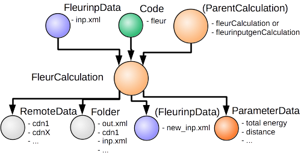

Description
'''''''''''
Use the plugin to support inputs of the Fleur code i.e. the 'fleur' and 'fleur_MPI' executable.

Supported codes
'''''''''''''''
* tested from Fleur v0.27 (MAX release 1.0) onwards. It is NOT back compatible to
  version v0.26 and earlier, because the I/O has changed completely and the plugin
  relies on the xml I/O.

Not (yet) supported code features
'''''''''''''''''''''''''''''''''

* sparning multiple fleur calculation with on execution of fleur in a certain subdir structure
  (on can parse the commandline switches, but it will fail, because the subdirs have to be prepared on the machine.)
* 1D, not supported by the plugin, but currently also not testest in Fleur 0.27
  (in principal possible, some plugin functionalities have to be updated.)

Partially supported yet
.......................

* LDA+U, not tested yet, in principal possible, but user has to take care of copying the files, nothing parsed to output
* Noncolinear Magnetism, not tested yet, in principal possible, but user has to take care of copying the extra files, not all information is parsed.
* Jijs same as nonco.
* Hybrid functionals same as noco
* Wannier 90 same as noco
  
  
Sketch of nodes
'''''''''''''''

Inputs
''''''
* **fleurinp**, class :py:class:`fleurinpData <aiida.orm.data.fleurinp>`
  Data structure which represents the inp.xml file everything a Fleur calculation needs.
  For more information see fleurinpData. 
* **parent_folder**, class :py:class:`RemoteData <aiida.orm.data.remote.RemoteData>` (optional)
  If specified, certain files in the scratch folder coming from a previous Fleur calculation is
  copied in the scratch of the new calculation.

Outputs
'''''''

* **fleurinp**, class :py:class:`fleurinpData <aiida.orm.data.fleurinp>` (optional)
  Data structure that represents the inp.xml file and provides useful methods.
  For more information see fleurinpData. (accessed by ‘’calculation.out.fleurinp’’)
  This will only be created if the crystal structure was changed during the fleur run.
* **output_parameters** class :py:class:`ParameterData <aiida.orm.data.parameter.ParameterData>` 
  (accessed by ``calculation.res``)
  Most important output node, contains all kinds of information of the calculation 
  and some physical quantities of the last iterations. 
  The node design was chooses along the output node for the pw.x AiiDA plugin from 
  quantum espresso.
  
an example output node:
  .. literalinclude:: output_node_example.py

.. note:: The 'simple' output node will evolve. A draft of a second complexer output node which contains informations of all iterations and atomtypes exists, but a dictionary is not the optimal structure for this. For now this is postponed. In any case if you want to parse something from the out.xml checkout the methods in xml_util.
  
Errors
''''''

Errors of the parsing are reported in the log of the calculation (accessible 
with the ``verdi calculation logshow`` command). 
Everything that Fleur writes into stderr is also shown here, i.e all JuDFT error messages.
Example::

    (env_aiida)% verdi calculation logshow 50891
    *** 50891 [scf: fleur run 1]: FAILED
    *** Scheduler output:
    *** 2 LOG MESSAGES:
    +-> WARNING at 2018-08-15 09:15:39.563297+00:00
    | The following was written into std error and piped to out.error : 
    |   
    |     0**************juDFT-Error*****************
    |    0Error message:E-field too big or No. of e- not correct
    |    0Error occurred in subroutine:efield
    |     0*****************************************
    | 
    |  
    |  Terminating all MPI processes.
    |  Note: This is a normal procedure.
    |        Error messages in the following lines can be ignored.
    |  
    | application called MPI_Abort(MPI_COMM_WORLD, 0) - process 0
                                                                      
Moreover, all warnings and errors written by Fleur in the out.xml file are stored in the ParameterData under the key ``warnings``, and are accessible with ``Calculation.res.warnings``.

Additional advanced features
''''''''''''''''''''''''''''

In general see the Fleur documenation: www.flapw.de

While the input link with name 'fleurinpdata' is used for the content of the 
inp.xml, additional parameters for changing the plugin behavior, can be specified in the 'settings' input,
also of type ParameterData.

Below we summarise some of the options that you can specify, and their effect.
In each case, after having defined the content of ``settings_dict``, you can use
it as input of a calculation ``calc`` by doing::

  calc.use_settings(ParameterData(dict=settings_dict))
  

Adding command-line options
...........................

If you want to add command-line options to the executable (particularly 
relevant e.g. '-hdf' use hdf, or '-magma' use different libaries, magma in this case) (see fleur -h or www.flapw.de), you can pass each option 
as a string in a list, as follows::

  settings_dict = {  
      'cmdline': ['-hdf', '-magma'],
  }

The default command-line of a fleur execution of the plugin looks like this for the torque scheduler:: 

'mpirun' '-np' 'XX' 'path_to_fleur_executable' '-wtime' 'XXX' < 'inp.xml' > 'shell.out' 2> 'out.error'

If the code node description contains 'hdf5' in some form, the plugin will use per default hdf5, it will only copy the last hdf5 density back, not the full cdn.hdf file.
The Fleur execution line becomes in this case::

'mpirun' '-np' 'XX' 'path_to_fleur_executable' '-last_extra' '-wtime' 'XXX' < 'inp.xml' > 'shell.out' 2> 'out.error'

  
Retrieving more files
.....................

The plugin retrieves per default the files : out.xml, out, cdn1 and inp.xml.
This way continuing a Fleur calculation from the repository is per default possible.
When certain inputs are given the plugin retrieves also the files:
* if band=T : bands.1, bands.2
* if dos=T: DOS.1, DOS.2
* if pot8=T : pot*
...

If you know that your calculation is producing additional files that you want to
retrieve (and preserve in the AiiDA repository in the long term), you can add
those files as a list as follows (here in the case of a file named
``testfile.txt``)::

  settings_dict = {  
    'additional_retrieve_list': ['testfile.txt'],
  }

Retrieving less files
.....................

If you know that you do not want to retrieve certain files(and preserve in the AiiDA repository in the long term). i.e. the cdn1 file is to large and it is stored somewhere else anyway, you can add
those files as a list as follows (here in the case of a file named
``testfile.txt``)::

  settings_dict = {  
    'remove_from_retrieve_list': ['testfile.txt'],
  }

Copy more files remotely
........................

The plugin copies per default the broyden files (broyd*) if a parent_folder is given in the input.

If you know that for your calculation you need some other files on the remote machine, you can add
those files as a list as follows (here in the case of a file named
``testfile.txt``)::

  settings_dict = {  
    'additional_remotecopy_list': ['testfile.txt'],
  }

Copy less files remotely
........................

If you know that for your calculation do not need some files which are copied per default by the plugin you can add those files as a list as follows (here in the case of a file named
``testfile.txt``)::

  settings_dict = {  
    'remove_from_remotecopy_list': ['testfile.txt'],
  }
  
  