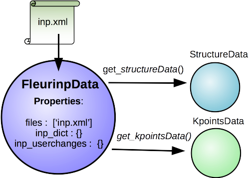

.. _fleurinp_data:

FleurinpData
============

* **Class**: :py:class:`~aiida_fleur.data.fleurinp.FleurinpData`
* **String to pass to the** :py:func:`~aiida.orm.utils.DataFactory`: ``fleur.fleurinp``
* **Aim**: store input files for the FLEUR code and provide userfriendly editing.
* **What is stored in the database**: the filenames, a parsed inp.xml files as nested dictionary
* **What is stored in the file repository**: inp.xml file and optional other files.
* **Additional functionality**: Provide userfriendly methods. Connected to structure and Kpoints AiiDA data structures

Description/Features
--------------------

..    :height: 300px

``FleurinpData`` is a additional AiiDA data structure which represents everything a Fleur calculation needs, which is mainly a complete ``inp.xml`` file. 

.. note:: Currently, ``FleurinpData`` methods support *ONLY* ``inp.xml`` files, which have everything in them (kpoints, energy parameters, ...), i.e which were created with the ``-explicit`` inpgen command line switch. 
          In general it was designed to account for several separate files too, but this is no the default way Fleur should be used with AiiDA.

``FleurinpData`` was implemented to make the plug-in user friendlier, hide complexity and ensure the connection to AiiDA data structures (``StructureData``, ``KpointsData``).
For more detailed information about the methods see below and check the module code documentation.

.. note:: For changing the input file use the ``Fleurinpmodifier`` class, because a new ``FleurinpData`` object has to be stored in the Database which will be linked in the database over a workfunction to the parent ``FleurinpData``.
          Otherwise the provenance of from where the new ``FleurinpData`` comes from is likely lost.

Initialization::

  from aiida_fleur.data.fleurinp import FleurinpData
  # or FleurinpData = DataFacotry('fleur.fleurinp')
  
  F = FleurinpData('path_to_inp.xml_file')
  #or 
  F = FleurinpData(files=['path_to_inp.xml_file', (some other files)])

Also be aware that the ``inp.xml`` file name has to be named 'inp.xml', i.e. no file names are changed,
the files will be given with the provided names to Fleur (so far).
Also if you add an other inp.xml file the first one will be overwritten.

Properties
----------

    * ``inp_dict``: Returns the inp_dict (the representation of the inp.xml file) as it will or is stored in the database.

    * ``files``: Returns the files, which were added to FleurinpData. (all files will be copied where Fleur is executed) 

    * ``_schema_file_path``: Returns the absolute path of the xml schema file used for the current inp.xml file.     

.. note::
  ``FleurinpData`` will first look in the ``aiida_fleur/fleur_schema/input/`` for matching Fleur xml schema files to the ``inp.xml`` files. 
  If it does not find a match there, it will rekursively serach in your PYTHONPATH and the current directory.
  If you installed the package with pip there should be no problem, as long the package versions is new enough for the version of the Fleur code you are deploying.  
      
User Methods
------------

    * ``get_file_abs_path('filename')`` : Returns the absolute path on the disk of a file belonging to ``FleurinpData``. 
    * ``del_file('filename')`` : Deletes a file from ``FleurinpData``.
    * ``set_file('path_to_file')`` : Adds a file to ``FleurinpData``.
    * ``set_files(list_of_paths_to_files)`` : Adds several files to ``FleurinpData``.
    * ``get_fleur_modes()`` : Retrieve information from the inp.xml file. 'Modes' are paths a FLEUR
      calculation can take, resulting in different output files, dependent on the input.
      i.e other files need to be copied before and after the calculation. (used by the parsers)
      common modes are: scf, jspin 2, dos, band, pot8, lda+U, eels, ...
      (Warning, currently not auto supported by the plugin are lda+U, 'magnetism', eels )
    * ``(wf) get_structuredata(fleurinp)`` : Workfunction, which returns an AiiDA ``StructureData`` type extracted from the inp.xml file. It this was done before, it returns the existing structure data node.
    * ``(wf) get_kpointsdata(fleurinp)`` : Workfunction, which returns an AiiDA ``KpointsData`` type produced from the inp.xml
      file. This only works if the kpoints are listed in the in inpxml.
    * ``(wf) get_parameterdata(fleurinp)`` : workfunction that extracts a ``ParameterData`` node, which contains FLAPW parameters, out of the inp.xml . This node can be an input for inpgen.
    * ``(wf) set_kpointsdata(fleurinp, kpointsdata)`` : This workfunction writes the all the kpoints from a ``KpointsData`` node in the
      inp.xml file as a kpointslist and return a new ``FleurinData``. It replaces the Kpoints written in the 
      inp.xml file. Currently, it is the users resposibility to provide a full
      ``KpointsData`` node with weights. In the future FLEUR might recalculate them.
      (might be moved to FleurinpModifier in the future)

Fleurinpmodifier
================

Description
-----------
The ``Fleurinpmodifier`` class has to be used if you want to change anything on a ``FleurinpData``. It will store and validate all the changes you which to do and produce a new ``FleurinpData`` node after you are done making changes and apply them.

``FleurinpDataModifier`` provides the user with methods to change the Fleur input. (not every possible change is supported, some changes are forbidden, others will be supported in the future). 
In principal the user can do everything, since he could prepare a fleur input himself, and create a ``FleurinpData`` object from that input.

.. note:: Why?
    In the open provanence model no data to data links exist and nodes once stored in the database cannot be changed anymore (except extras and comments). Therefore, to modify something in the inp.xml file one has to create a new FleurinpData which is not stored, modify it and store it again. But this node would pop into existence unlinked in the database and this would mean we loose the origin from what data it comes from and what was done to it. This is the task of Fleurinpmodifier.

Usage:
------
One creates a ``Fleurinpmodifier`` with a ``FleurinpData`` object (1). Now the user can perform certain modifications which will be cached and can be previewed (2-3). They will only be applied on a new ``FleurinpData`` object when the freeze method is executed (4).
code example::
  
  from aiida_fleur.data.fleurinpmodifier import  FleurinpModifier
  
  F = FleurinpData('path_to_inp.xml_file')
  fm = FleurinpModifier(F)
  fm.set_inpchanges({'dos' : True, 'Kmax': 3.9 })
  fm.show()
  new_fleurinpdata = fm.freeze()
  

User Methods
------------

General methods:

    * ``validate()`` : Test if the changes in the queue validate
    * ``freeze()`` : Applies all the changes in the queue (calls the workfunction ``modify_fleurinpdata``) and returns a new ``FleurinpData`` object
    * ``changes()`` : Displays the current queue of changes
    * ``show(display=True, validate=False)`` :  Test applies the modifications and displayes/prints the resulting ``inp.xml`` file.

Change methods:

    * ``xml_set_attribv_occ(xpathn, attributename, attribv, occ=[0], create=False)`` : Set an attribute of a specific occurance of xml elements
    * ``xml_set_first_attribv(xpathn, attributename, attribv, create=False)`` : Set an attribute of first occurance of xml element
    * ``xml_set_all_attribv(xpathn, attributename, attribv, create=False)`` : Set an attribute of several xml elements
    * ``xml_set_text(xpathn, text, create=False)`` : Set the text of first occurance of xml element
    * ``xml_set_all_text(xpathn, text, create=False)`` : Set the text of xml elements
    * ``create_tag(xpath, newelement, create=False)`` : Insert an xml element in the xml tree.
    * ``delete_att(xpath, attrib)`` : Delete an attribute for xml elements from the xpath evaluation.
    * ``delete_tag(xpath)`` : Delete an xml element.
    * ``replace_tag(xpath, newelement)`` : Replace an xml element.
    * ``set_species(species_name, attributedict, create=False)`` : Specific userfriendly method to change species parameters.
    * ``set_atomgr_att(attributedict, position=None, species=None,create=False)`` :  Specific method to change atom group parameters.
    * ``set_inpchanges(self, change_dict)`` : Specific userfriendly method for easy changes of attribute key value type.
    * ``set_nkpts(self, count, gamma='F')`` : Specific method to set the number of kpoints.

.. Node graphs
.. -----------

.. 1. After any modification was applied to fleurinpData the following nodes will be found in the database to keep the Provenance

.. 2. extract kpoints
.. 3. extract structuredata
.. 4. extract parameterdata
