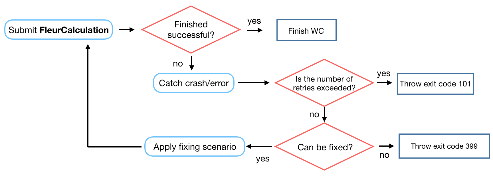

.. _base_wc:

Fleur base restart workchain
----------------------------

* **Current version**: 0.1.0
* **Class**: :py:class:`~aiida_fleur.workflows.base_fleur.FleurBaseWorkChain`
* **String to pass to the** :py:func:`~aiida.plugins.WorkflowFactory`: ``fleur.base``
* **Workflow type**: Technical
* **Aim**: Automatically resubmits a FleurCalculation in case of failure
* **Computational demand**: Corresponding to a single ``FleurCalculation``
* **Database footprint**: Links to the FleurCalculation output nodes and full provenance
* **File repository footprint**: no addition to the ``CalcJob`` run

.. contents::

Import Example:

.. code-block:: python

    from aiida_fleur.workflows.base_fleur import FleurBaseWorkChain
    #or
    WorkflowFactory('fleur.base')

Description/Purpose
^^^^^^^^^^^^^^^^^^^

This workchain wraps :py:class:`~aiida_fleur.calculation.fleur.FleurCalculation`
into BaseRestartWorkChain
workchain, which is a plain copy of a BaseRestartWorkChain originally implemented in
AiiDA-QE. This workchain  automatically
tracks and fixes crashes of the :py:class:`~aiida_fleur.calculation.fleur.FleurCalculation`.

.. note::

    This workchain accepts all of the inputs that is needed for the FleurCalculation. It also
    contains all the links of the outputs generated by the FleurCalculation. It most of the cases,
    a user does not feel the difference in the front-end behaviour of FleurCalculation and
    FleurBaseWorkChain.

The workchain works as follows:

For now only problems with memory can be fixed in
:py:class:`~aiida_fleur.workflows.base_fleur.FleurBaseWorkChain`
:if a FleurCalculation finishes with exit status 310
the FleurBaseWorkChain will resubmit it setting twice larger number of computational nodes.

.. warning::

    The exit status 310 can be thrown only in case of using Intel complier for the Fleur code.

:py:func:`~aiida_fleur.workflows.base_fleur.FleurBaseWorkChain.check_kpts()` method
^^^^^^^^^^^^^^^^^^^^^^^^^^^^^^^^^^^^^^^^^^^^^^^^^^^^^^^^^^^^^^^^^^^^^^^^^^^^^^^^^^^^^^^

Fixing failed calculations is not the only task of
:py:class:`~aiida_fleur.workflows.base_fleur.FleurBaseWorkChain`. It also implements automatic
parallelisation routine called
:py:func:`~aiida_fleur.workflows.base_fleur.FleurBaseWorkChain.check_kpts()`. The task of this
method is to ensure the perfect k-point parallelisation of the FLEUR code.
It tries to set up the number of nodes and mpi tasks in a way that the total number of used cores is
a factor of the total number of k-points. Therefore a user actually specifies not the actual
resources to be used in a calculation but their maximum possible values.

There is no OpenMPI parallelisation yet.

.. note::

    Before setting the actual resources to the calculation,
    :py:func:`~aiida_fleur.workflows.base_fleur.FleurBaseWorkChain.check_kpts()` can throw an
    exit code if the suggested load of each node is smaller than 60% of what specified by user.
    For example, if user specifies:

    .. code-block:: python

        options = {'resources' : {"num_machines": 4, "num_mpiprocs_per_machine" : 24}

    and :py:func:`~aiida_fleur.workflows.base_fleur.FleurBaseWorkChain.check_kpts()` suggested to
    use 4 ``num_machines`` and 13 ``num_mpiprocs_per_machine`` the exit code will be thrown and
    calculation will not be submitted.

.. _PBS-like: https://aiida.readthedocs.io/projects/aiida-core/en/latest/scheduler/index.html?highlight=schedulers#supported-schedulers

.. warning::

    This method works with `PBS-like`_ schedulers only and if ``num_machines`` and
    ``num_mpiprocs_per_machine`` are specified. Thus it method can be updated/deprecated for
    other schedulers and situations. Please feel free to write an issue on this arguable
    function.

Errors
^^^^^^
See :ref:`exit_codes`.
+-----------+------------------------------------------------------------------------------+
| Exit code | Reason                                                                       |
+===========+==============================================================================+
| 101       | Maximum number of fixing an error is exceeded                                |
+-----------+------------------------------------------------------------------------------+
| 102       | The calculation failed for an unknown reason, twice in a row                 |
|           | This should probably never happen since there is a 399 exit code             |
+-----------+------------------------------------------------------------------------------+
| 360       | :py:func:`~aiida_fleur.workflows.base_fleur.FleurBaseWorkChain.check_kpts()` |
|           | suggests less than 60% of node load                                          |
+-----------+------------------------------------------------------------------------------+

Exit codes duplicating FleurCalculation exit codes:

+-----------+------------------------------------------------------------------------------+
| Exit code | Reason                                                                       |
+===========+==============================================================================+
| 311       | FleurCalculation failed because an atom spilled to the vacuum during         |
|           | relaxation.                                                                  |
+-----------+------------------------------------------------------------------------------+
| 312       | FleurCalculation failed due to MT overlap.                                   |
+-----------+------------------------------------------------------------------------------+
| 399       | FleurCalculation failed and FleurBaseWorkChain                               |
|           | has no strategy to resolve this                                              |
+-----------+------------------------------------------------------------------------------+
