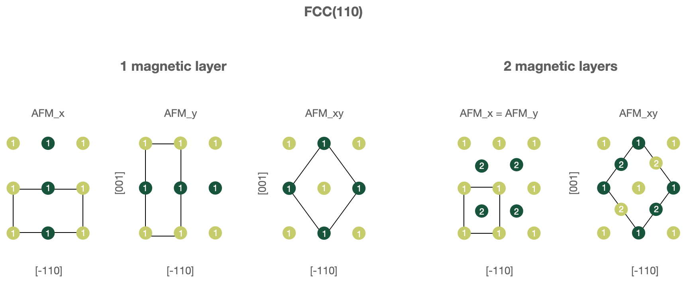
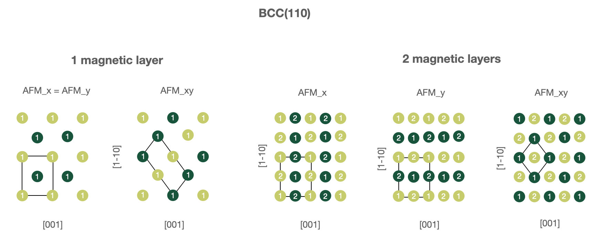

.. _create_magnetic_wc:

Fleur Create Magnetic Film workchain
--------------------------------------

* **Current version**: 0.2.0
* **Class**: FleurCreateMagneticWorkChain
* **String to pass to the** :py:func:`~aiida.plugins.WorkflowFactory`: ``fleur.create_magnetic``
* **Workflow type**: Scientific workchain

.. contents::
    :depth: 2

Import Example:

.. code-block:: python

    from aiida_fleur.workflows.create_magnetic_film import FleurCreateMagneticWorkChain
    #or
    WorkflowFactory('fleur.create_magnetic')

Description/Purpose
^^^^^^^^^^^^^^^^^^^
The workchain constructs a relaxed film structure which is ready-to-use in following
magnetic workchains: :ref:`DMI<dmi_wc>`, :ref:`MAE<mae_wc>` or :ref:`SSDisp<ssdisp_wc>`.

The inputs include information about the substrate (structure type, miller indices of surfaces or vectors
forming the primitive unit cell, chemical elements)
and deposited material. The main logic of the workchain is depicted on the figure below:

.. image:: images/create_magnetic_scheme.png
    :width: 100%
    :align: center

First, the workchain uses :ref:`EOS workchain<eos_wc>` to find the equilibrium lattice parameters for
the substrate. For now only bcc and fcc lattices are supported. Note, the algorithm always
uses conventional unit cells e.g. one gets 4 atoms in the unit cell for fcc lattice (see the figure
above).

After the EOS step the workchain constructs a film which will be used for interlayer distance
relaxation via the :ref:`relaxation workchain<relax_wc>`. The algorithm creates a film using given
miller indices and the ground state lattice constant and replaces some layers with another
elements given
in the input. For now only single-element layer replacements are possible i.e. each resulting layer
can be made of a single element. It is not possible to create e.g. B-N monolayer using this
workchain.

Finally, using the result of the relaxation workchain, a magnetic structure having no z-reflection symmetry is
constructed. For this the workchain takes first ``num_relaxed_layers`` layers from the relaxed structure and attaches
so many substrate layers so there are ``total_number_layers`` layers. The final structure is z-centralised.

.. _exposed: https://aiida.readthedocs.io/projects/aiida-core/en/latest/working/workflows.html#working-workchains-expose-inputs-outputs

Input nodes
^^^^^^^^^^^

The FleurCreateMagneticWorkChain employs
`exposed`_ feature of the AiiDA-core, thus inputs for the
:ref:`EOS<eos_wc>` and :ref:`relaxation<relax_wc>` workchains should be passed in the namespaces
``eos`` and ``relax`` correspondingly (see :ref:`example of usage<example_use_create_magnetic>`).
Please note that the `structure` input node
is excluded from the EOS namespace and from the Relax SCF namespace
since corresponding input structures are created within the CreateMagnetic workchain.

+---------------------+-------------------------------------+--------------------------------------------------------------------------------------+----------+
| name                | type                                | description                                                                          | required |
+=====================+=====================================+======================================================================================+==========+
| eos                 | namespace                           | inputs for nested EOS WC. structure input is excluded.                               | no       |
+---------------------+-------------------------------------+--------------------------------------------------------------------------------------+----------+
| relax               | namespace                           | inputs for nested Relax WC. structure input of SCF sub-namespace is excluded         | no       |
+---------------------+-------------------------------------+--------------------------------------------------------------------------------------+----------+
| wf_parameters       | :py:class:`~aiida.orm.Dict`         | Settings of the workchain                                                            | no       |
+---------------------+-------------------------------------+--------------------------------------------------------------------------------------+----------+
| eos_output          | :py:class:`~aiida.orm.Dict`         | :ref:`EOS<eos_wc>` output dictionary                                                 | no       |
+---------------------+-------------------------------------+--------------------------------------------------------------------------------------+----------+
| optimized_structure | :py:class:`~aiida.orm.StructureData`| relaxed film structure                                                               | no       |
+---------------------+-------------------------------------+--------------------------------------------------------------------------------------+----------+
| distance_suggestion | :py:class:`~aiida.orm.Dict`         | interatomic distance suggestion, output of                                           | no       |
|                     |                                     | the ``request_average_bond_length_store()``                                          |          |
+---------------------+-------------------------------------+--------------------------------------------------------------------------------------+----------+

Similarly to other workchains,
FleurCreateMagneticWorkChain behaves
differently depending on the input nodes setup. The list of supported input configurations is
given in the section :ref:`layout_create_magnetic`.

.. _defaults_para_create:

Workchain parameters and its defaults
.....................................

``wf_parameters``
,,,,,,,,,,,,,,,,,

``wf_parameters``: :py:class:`~aiida.orm.Dict` - Settings of the workflow behavior. All possible
keys and their defaults are listed below:

.. literalinclude:: code/create_magnetic_parameters.py

.. _ase: https://wiki.fysik.dtu.dk/ase/ase/lattice.html#general-crystal-structures-and-surfaces

Some of the parameters, which can be set in the workchain parameter dictionary, control how the structure will
be created for the relaxation step. The following procedure is used to construct a film for relaxation:

  1. Create a slab using ASE methods. For this following parameters are used: ``lattice``, ``miller`` or ``directions``,
     ``host_symbol``, ``size`` and ``latticeconstant`` (or lattice constant from ``distance_suggestion`` input node).
     For more details refer to `ase`_ documentation.

  2. Remove pop_last_layers last layers. This step can help one to ensure symmetrical film.

  .. note::

      z-reflection or inversion symmetries are not ensured by the workchain even if you
      specify symmetric replacements. Sometimes you need to remove a few layers before replacements.
      For example, consider the case of fcc (110) film: if ``size`` is equal to (1, 1, 4) there are
      will
      be 8 layers in the slab since there are 2 layers in the unit cell.
      That means the x,y positions of the atom in the first layer
      are equal to (0.0, 0.0) and the 8th layer coordinates are equal to (0.5, 0.5).
      Thus, to achieve
      z-reflection symmetry one needs to remove the 8th layer by specifying ``'pop_last_layers' : 1``
      in the wf parameters.

  3. Replace atom layers according to ``replacements`` dictionary. The dictionary should consist of INT: STRING pairs,
     where INT defines the layer number to be replaced (counting from the lowest layers, INT=1 for the first layer
     and INT=-1 for the last) and STRING defines the element name.

  4. Adjust interlayer distances using ``distance_suggestion``, ``first_layer_factor`` and ``last_layer_factor``. if
     the input structure has z-reflection symmetry, then ``first_layer_factor`` is ignored and the ``last_layer_factor``
     controls both surface layers. If ``AFM_layer_positions`` is given and AFM structures are known for the input
     lattice and directions, then the
     adjusting procedure will not do it automatically, but simply enforce z-coordinates from ``AFM_layer_positions``.
     Read more in the section :ref:`structures_AFM`.

  .. warning::

      Adjusting of interlayer distances for non-symmetric films work well only if substrate is positioned above magnetic
      elements (z-coordinate of substrate atoms are higher than magnetic ones). This can be achieved by using
      ``replacements: {1: 'Fe'}`` instead of ``replacements: {-1: 'Fe'}``.

  1. Mark fixed layers according to ``hold_layers``. ``hold_layers`` is a list of layer number to be marked as fixed
     during the relaxation step. Similarly to replacements, the 1st layer corresponds to number 1 and the last to -1.

After the structure is relaxed, the final magnetic non-symmetrical structure is constructed. For this
``total_number_layers`` and ``num_relaxed_layers`` setting the total number of layers of the number of layers extracted
from the relaxed structure respectively.

Output nodes
^^^^^^^^^^^^^

  * ``magnetic_structure``: :py:class:`~aiida.orm.StructureData`- the relaxed film structure.

.. _layout_create_magnetic:

Supported input configurations
^^^^^^^^^^^^^^^^^^^^^^^^^^^^^^

CreateMagnetic workchain has several
input combinations that implicitly define the workchain layout. **eos**, **relax**,
**optimized_structure** and **eos_output** are analysed. Depending
on the given setup of the inputs, one of four supported scenarios will happen:

1. **eos** + **relax** + **distance_suggestion**:

    The EOS will be used to calculate the equilibrium structure
    of the substrate, then Relax WC will be used to relax the interlayer distances. Finally,
    the non-symmetrical magnetic structure will be created. A good choice if there is nothing
    to begin with. **distance_suggestion** will be used to guess a better starting interlayer
    distances before submitting Relax WC.

2. **eos_output** + **relax** + **distance_suggestion**:

    The equilibrium substrate structure will be extracted from the **eos_output**,
    then Relax WC will be used to relax the interlayer distances. Finally,
    the non-symmetrical magnetic structure will be created. A good choice if EOS was previously done
    for the substrate. **distance_suggestion** will be used to guess a better starting interlayer
    distances before submitting Relax WC.

3. **optimized_structure**:

    **optimized_structure** will be treated as a result of Relax WC and directly used to
    construct the final non-symmetrical magnetic structure. A good choice if everything
    was done except the very last step.

4. **relax**:

    Relax WC will be submitted using inputs of the namespace, which means one can for instance
    continue a relaxation procedure. After Relax WC is finished, the
    non-symmetrical magnetic structure will be created. A good choice if something wrong happened
    in one of the relaxation steps of another CreateMagnetic workchain submission.

All the other input configuration will end up with an exit code 231, protecting user from
misunderstanding.

Error handling
^^^^^^^^^^^^^^
A list of implemented :ref:`exit codes<exit_codes>`:

+------+------------------------------------------------------------------------------------------+
| Code | Meaning                                                                                  |
+======+==========================================================================================+
| 230  | Invalid workchain parameters                                                             |
+------+------------------------------------------------------------------------------------------+
| 231  | Invalid input configuration                                                              |
+------+------------------------------------------------------------------------------------------+
| 380  | Specified substrate is not bcc or fcc, only them are supported                           |
+------+------------------------------------------------------------------------------------------+
| 382  | Relaxation calculation failed.                                                           |
+------+------------------------------------------------------------------------------------------+
| 383  | EOS WorkChain failed.                                                                    |
+------+------------------------------------------------------------------------------------------+

.. _structures_AFM:

Structures with known AFM structures
^^^^^^^^^^^^^^^^^^^^^^^^^^^^^^^^^^^^

.. warning::

    The workchain uses ``define_AFM_structures`` method to mark spin-up and spin-down atoms. It does not actually set
    initial moment, a user is responsible for adding ``inpxml_changes`` changing the initial spin. For instance,
    for MaX4 FLEUR one can use following ``inpxml_changes`` to set initial moments for AFM structure:

    .. code-block:: python

        'inpxml_changes': [('set_species_label', {'at_label': '49990',
                                                  'attributedict': {'magMom': 4.0},
                                                  'create': True}),
                           ('set_species_label', {'at_label': '49991',
                                                  'attributedict': {'magMom': -4.0},
                                                  'create': True})]}

    Spin-up atoms are marked by label ``'49990'`` and spin-down atoms are marked by ``'49991'``. Please make sure that
    these labels are not overwritten, for example by fixing atoms label.

1. FCC(110) surfaces, 1 or 2 magnetic layers.

    In this case one must use following parameters in the ``wf_parameters``:

    .. code::

        'lattice': 'fcc'
        'directions': [[-1, 1, 0], [0, 0, 1], [1, 1, 0]]
        'magnetic_layers': 1 or 2
        'AFM_name': 'FM', 'AFM_x', 'AFM_y' or 'AFM_xy'

    Note that for ``'AFM_xy'`` structure unit vectors forming a computational cell are changed to
    ``[[-1, 1, 2], [1, -1, 2], [1, 1, 0]]``.

1. BCC(110) surfaces, 1 or 2 magnetic layers.

    In this case one must use following parameters in the ``wf_parameters``:

    .. code::

        'lattice': 'bcc'
        'directions': [[1, -1, 1], [1, -1, -1], [1, 1, 0]]
        'magnetic_layers': 1 or 2
        'AFM_name': 'FM', 'AFM_x', 'AFM_y' or 'AFM_xy'

    Note that for ``'AFM_x'`` and ``'AFM_y'`` structure unit vectors forming a computational cell are changed to
    ``[[0, 0, 1], [1, -1, 0], [1, 1, 0]]``.

    .. warning::

        The check of input lattice vector directions is hardcoded,
        which means that the code will not recognize ``'bcc'`` and
        ``'[[-1, 1, -1], [-1, 1, 1], [1, 1, 0]]'`` despite it produces the same structure. In this case the workchain
        will be excepted.

There is a possibility to enforce layer z-coordinates for generating AFM structures. This allows one to reuse the
relaxed FM structured for following AFM calculation to save computational resources because it is expected that the FM
relaxed structure is a better initial guess for an AFM one rather than a structure, proposed by automatic adjusting
function. To do this, one should make sure that the length of ``AFM_layer_positions`` is the same as the total number
of layers of the AFM structure and ``magnetic_layers`` is correctly initialised.

Figures below illustrate known AFM structures for FCC(110) and BCC(110) structures. The number on each atoms
shows to which layer atom belongs (first or second) and the color corresponds to spin orientation (up or down).
Note that the input computational unit cell will be changed (shown on the figures),
hence you might want to adjust the k-mesh correspondingly.

.. _example_use_create_magnetic:

Example usage
^^^^^^^^^^^^^

  .. literalinclude:: code/create_magnetic_submission.py
