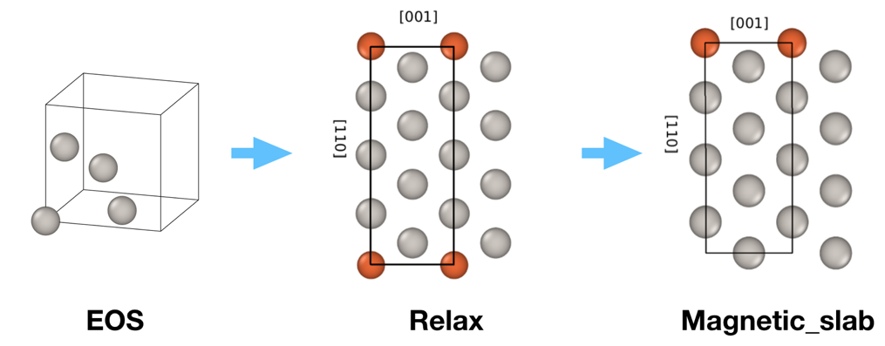

.. _create_magnetic_wc:

Fleur Create Magnetic Film workchain
--------------------------------------

* **Current version**: 0.1.0
* **Class**: :py:class:`~aiida_fleur.workflows.create_magnetic_film.FleurCreateMagneticWorkChain`
* **String to pass to the** :py:func:`~aiida.plugins.WorkflowFactory`: ``fleur.create_magnetic``
* **Workflow type**: Scientific workchain

.. contents::
    :depth: 2

Import Example:

.. code-block:: python

    from aiida_fleur.workflows.create_magnetic_film import FleurCreateMagneticWorkChain
    #or
    WorkflowFactory('fleur.create_magnetic')

Description/Purpose
^^^^^^^^^^^^^^^^^^^
The workchain constructs a relaxed film structure which is ready-to-use in the subsequent
magnetic workchains, such as :ref:`DMI<dmi_wc>`, :ref:`MAE<mae_wc>` or :ref:`SSDisp<ssdisp_wc>`
worlchains.

The main inputs include information about the substrate (structure type, miller indices, element)
and deposited material. The main logic of the workchain is depicted on the figure below:

First, workchains uses :ref:`EOS workchain<eos_wc>` to find the equilibrium lattice parameters for
the substrate. Then the workchain constructs a film which will be used for interlayer distance
relaxation via the :ref:`relaxation workchain<relax_wc>`. Finally, using the results of the
relaxation workchain, a magnetic structure having no z-reflection (or inversion) symmetry is
created.

Input nodes
^^^^^^^^^^^
The :py:class:`~aiida_fleur.workflows.create_magnetic_film.FleurCreateMagneticWorkChain` employs
`exposed_inputs` and `exposed_outputs` feature of the AiiDA-core, thus inputs for the
:ref:`EOS<eos_wc>` and :ref:`relaxation<relax_wc>` workchains should be passed in the namespaces
``eos`` and ``relax`` correspondingly (see :ref:`example_use_create_magnetic`).

+-----------------+----------------------------------------------------+-----------------------------------------+----------+
| name            | type                                               | description                             | required |
+=================+====================================================+=========================================+==========+
| wf_parameters   | :py:class:`~aiida.orm.Dict`                        | Settings of the workchain               | no       |
+-----------------+----------------------------------------------------+-----------------------------------------+----------+
| eos_output      | :py:class:`~aiida.orm.Dict`                        | :ref:`EOS<eos_wc>` output dictionary    | no       |
+-----------------+----------------------------------------------------+-----------------------------------------+----------+

Workchain parameters and its defaults
.....................................

``wf_parameters``
,,,,,,,,,,,,,,,,,

``wf_parameters``: :py:class:`~aiida.orm.Dict` - Settings of the workflow behavior. All possible
keys and their defaults are listed below:

.. literalinclude:: code/create_magnetic_parameters.py

Output nodes
^^^^^^^^^^^^^

  * ``magnetic_structure``: :py:class:`~aiida.orm.StructureData`- the relaxed film structure.

.. _layout_create_magnetic:

Supported input configurations
^^^^^^^^^^^^^^^^^^^^^^^^^^^^^^
To be documented.

Error handling
^^^^^^^^^^^^^^
A list of implemented exit codes:

+------+------------------------------------------------------------------------------------------+
| Code | Meaning                                                                                  |
+======+==========================================================================================+
| 401  | Specified substrate is not bcc or fcc, only them are supported                           |
+------+------------------------------------------------------------------------------------------+
| 402  | eos_output was not specified, however, 'eos_needed' was set to True                      |
+------+------------------------------------------------------------------------------------------+

.. _example_use_create_magnetic:

Example usage
^^^^^^^^^^^^^

  .. literalinclude:: code/create_magnetic_submission.py
