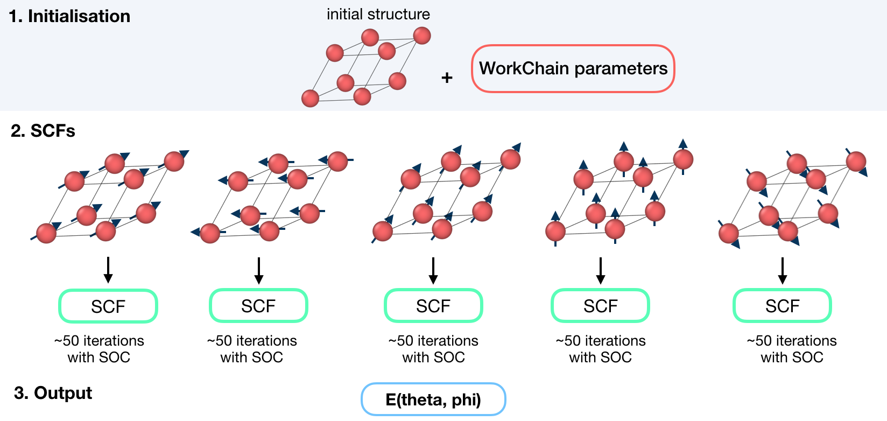

.. _mae_conv_wc:

Fleur Magnetic Anisotropy Energy Converge workchain
----------------------------------------------------------

* **Current version**: 0.2.0
* **Class**: :py:class:`~aiida_fleur.workflows.mae_conv.FleurMaeConvWorkChain`
* **String to pass to the** :py:func:`~aiida.plugins.WorkflowFactory`: ``fleur.mae_conv``
* **Workflow type**: Scientific workchain, self-consistent subgroup

.. contents::

Import Example:

.. code-block:: python

    from aiida_fleur.workflows.mae_conv import FleurMaeConvWorkChain
    #or
    WorkflowFactory('fleur.mae_conv')

Description/Purpose
^^^^^^^^^^^^^^^^^^^
This workchain calculates Magnetic Anisotropy Energy over a given set of spin-quantization axes.
The force-theorem is employed which means the workchain converges a reference charge density first
then it submits a single FleurCalculation with a `<forceTheorem>` tag.

The task of the workchain us to calculate the energy difference between two or several structures
having a different magnetisation profile:

.. image:: images/mae_energies.png
    :width: 60%
    :align: center

To do this, the workchain employs the force theorem approach:

.. _exposed: https://aiida.readthedocs.io/projects/aiida-core/en/latest/working/workflows.html#working-workchains-expose-inputs-outputs

Input nodes
^^^^^^^^^^^

The FleurSSDispWorkChain employs
`exposed`_ feature of the AiiDA, thus inputs for the nested
:ref:`SCF<scf_wc>` workchain should be passed in the namespace
``scf``.

+-----------------+-----------------------------+---------------------------------+----------+
| name            | type                        | description                     | required |
+=================+=============================+=================================+==========+
| scf             | namespace                   | inputs for nested SCF WorkChain | yes      |
+-----------------+-----------------------------+---------------------------------+----------+
| wf_parameters   | :py:class:`~aiida.orm.Dict` | Settings of the workchain       | no       |
+-----------------+-----------------------------+---------------------------------+----------+

Workchain parameters and its defaults
.....................................

``wf_parameters``
,,,,,,,,,,,,,,,,,

``wf_parameters``: :py:class:`~aiida.orm.Dict` - Settings of the workflow behavior. All possible
keys and their defaults are listed below:

.. literalinclude:: code/mae_conv_parameters.py

**soc_off** is a python list containing atoms labels. SOC is switched off for species,
corresponding to the atom with a given label.

.. note::

    It can be that the specie correspond to several atoms and **soc_off** switches off SOC for atoms
    that was not intended to change. You must be careful and make sure that several atoms do not
    correspond to a given specie.

An example of **soc_off** work:

.. code-block:: python

    'soc_off': ['458']

changes

.. code-block:: html

      <species name="Ir-2" element="Ir" atomicNumber="77" coreStates="17" magMom=".00000000" flipSpin="T">
        <mtSphere radius="2.52000000" gridPoints="747" logIncrement=".01800000"/>
        <atomicCutoffs lmax="8" lnonsphr="6"/>
        <energyParameters s="6" p="6" d="5" f="5"/>
        <prodBasis lcutm="4" lcutwf="8" select="4 0 4 2"/>
        <lo type="SCLO" l="1" n="5" eDeriv="0"/>
      </species>
      -----
      <atomGroup species="Ir-2">
        <filmPos label="                 458">1.000/4.000 1.000/2.000 11.4074000502</filmPos>
        <force calculate="T" relaxXYZ="TTT"/>
        <nocoParams l_relax="F" alpha=".00000000" beta=".00000000" b_cons_x=".00000000" b_cons_y=".00000000"/>
      </atomGroup>

to:

.. code-block:: html

      <species name="Ir-2" element="Ir" atomicNumber="77" coreStates="17" magMom=".00000000" flipSpin="T">
        <mtSphere radius="2.52000000" gridPoints="747" logIncrement=".01800000"/>
        <atomicCutoffs lmax="8" lnonsphr="6"/>
        <energyParameters s="6" p="6" d="5" f="5"/>
        <prodBasis lcutm="4" lcutwf="8" select="4 0 4 2"/>
        <special socscale="0.0"/>
        <lo type="SCLO" l="1" n="5" eDeriv="0"/>
      </species>

As you can see, I was careful about "Ir-2" specie  and it contained a single atom with a
label 458. Please also refer to :ref:`setting_labels` section to learn how to set labels up.

**sqas** is a python dictionary (``key: value`` pairs). The ``key`` can be any string which
sets a label of the SQA. ``value`` must be a list of 2 values: ``[theta, phi]``.

Output nodes
^^^^^^^^^^^^^

  * ``out``: :py:class:`~aiida.orm.Dict` -  Information of
    workflow results like success, last result node, list with convergence behavior

    .. code-block:: python

        {
            "errors": [],
            "failed_labels": [],
            "info": [],
            "mae": {
                "label": 0.001442720531486,
                "label2": 0.0
            },
            "mae_units": "eV",
            "sqa": {
                "label": [
                    0.0,
                    0.0
                ],
                "label2": [
                    1.57079,
                    1.57079
                ]
            },
            "warnings": [],
            "workflow_name": "FleurMaeConvWorkChain",
            "workflow_version": "0.1.0"
        }

    Resulting MAE energies are listed according to given labels.

.. _layout_mae_conv:

Layout
^^^^^^^^^^^^^^^^^^^^^^^^^^^^^^

MAE converge always starts with a structure and a list of q-vectors to calculate. There is no
way to continue from pre-converged charge density.

Error handling
^^^^^^^^^^^^^^
A list of implemented :ref:`exit codes<exit_codes>`:

+------+------------------------------------------------------------------------------------------+
| Code | Meaning                                                                                  |
+======+==========================================================================================+
| 230  | Invalid workchain parameters                                                             |
+------+------------------------------------------------------------------------------------------+
| 342  | Convergence MAE calculation failed for all SQAs                                          |
+------+------------------------------------------------------------------------------------------+
| 343  | Convergence MAE calculation failed for all SQAs                                          |
+------+------------------------------------------------------------------------------------------+

Example usage
^^^^^^^^^^^^^

  .. literalinclude:: code/mae_conv_wc_submission.py
