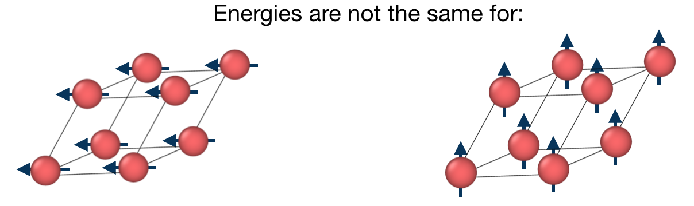
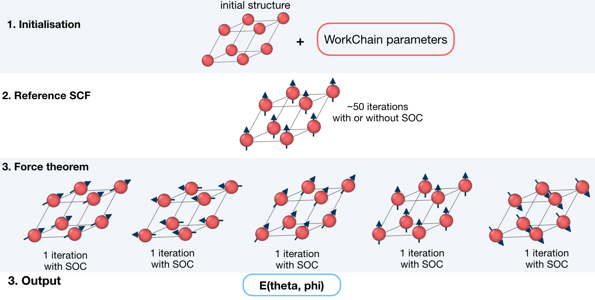

.. _mae_wc:

Fleur Magnetic Anisotropy Energy workflow
-----------------------------------------

* **Current version**: 0.2.0
* **Class**: :py:class:`~aiida_fleur.workflows.mae.FleurMaeWorkChain`
* **String to pass to the** :py:func:`~aiida.plugins.WorkflowFactory`: ``fleur.mae``
* **Workflow type**: Scientific workchain, force-theorem subgroup
* **Aim**: Calculate Magnetic Anisotropy Energies along given spin quantization axes

.. contents::
    :depth: 2

Import Example:

.. code-block:: python

    from aiida_fleur.workflows.mae import FleurMaeWorkChain
    #or
    WorkflowFactory('fleur.mae')

Description/Purpose
^^^^^^^^^^^^^^^^^^^
This workchain calculates Magnetic Anisotropy Energy over a given set of spin-quantization axes.
The force-theorem is employed which means the workchain converges a reference charge density first
then it submits a single FleurCalculation with a `<forceTheorem>` tag.

The task of the workchain us to calculate the energy difference between two or several structures
having a different magnetisation profile:

To do this, the workchain employs the force theorem approach:

It is not always necessary to start with a structure. Setting up input
parameters correctly (see :ref:`layout_ssdisp`) one can start from a given FleuinpData, inp.xml
or converged/not-fully-converged reference charge density.

.. _exposed: https://aiida.readthedocs.io/projects/aiida-core/en/latest/working/workflows.html#working-workchains-expose-inputs-outputs

Input nodes
^^^^^^^^^^^

The FleurMaeWorkChain employs
`exposed`_ feature of the AiiDA, thus inputs for the nested
:ref:`SCF<scf_wc>` workchain should be passed in the namespace
``scf``.

+-----------------+----------------------------------------------------+-----------------------------------------+----------+
| name            | type                                               | description                             | required |
+=================+====================================================+=========================================+==========+
| scf             | namespace                                          | inputs for nested SCF WorkChain         | no       |
+-----------------+----------------------------------------------------+-----------------------------------------+----------+
| fleur           | :py:class:`~aiida.orm.Code`                        | Fleur code                              | yes      |
+-----------------+----------------------------------------------------+-----------------------------------------+----------+
| wf_parameters   | :py:class:`~aiida.orm.Dict`                        | Settings of the workchain               | no       |
+-----------------+----------------------------------------------------+-----------------------------------------+----------+
| fleurinp        | :py:class:`~aiida_fleur.data.fleurinp.FleurinpData`| :ref:`FLEUR input<fleurinp_data>`       | no       |
+-----------------+----------------------------------------------------+-----------------------------------------+----------+
| remote          | :py:class:`~aiida.orm.RemoteData`                  | Remote folder of another calculation    | no       |
+-----------------+----------------------------------------------------+-----------------------------------------+----------+
| options         | :py:class:`~aiida.orm.Dict`                        | AiiDA options (computational resources) | no       |
+-----------------+----------------------------------------------------+-----------------------------------------+----------+

Only **fleur** input is required. However, it does not mean that it is enough to specify **fleur**
only. One *must* keep one of the supported input configurations described in the
:ref:`layout_mae` section.

Workchain parameters and its defaults
.....................................

``wf_parameters``
,,,,,,,,,,,,,,,,,

``wf_parameters``: :py:class:`~aiida.orm.Dict` - Settings of the workflow behavior. All possible
keys and their defaults are listed below:

.. literalinclude:: code/mae_parameters.py

**soc_off** is a python list containing atoms labels. SOC is switched off for species,
corresponding to the atom with a given label.

.. note::

    It can be that the specie correspond to several atoms and **soc_off** switches off SOC for atoms
    that was not intended to change. You must be careful and make sure that several atoms do not
    correspond to a given specie.

An example of **soc_off** work:

.. code-block:: python

    'soc_off': ['458']

changes

.. code-block:: html

      <species name="Ir-2" element="Ir" atomicNumber="77" coreStates="17" magMom=".00000000" flipSpin="T">
        <mtSphere radius="2.52000000" gridPoints="747" logIncrement=".01800000"/>
        <atomicCutoffs lmax="8" lnonsphr="6"/>
        <energyParameters s="6" p="6" d="5" f="5"/>
        <prodBasis lcutm="4" lcutwf="8" select="4 0 4 2"/>
        <lo type="SCLO" l="1" n="5" eDeriv="0"/>
      </species>
      -----
      <atomGroup species="Ir-2">
        <filmPos label="                 458">1.000/4.000 1.000/2.000 11.4074000502</filmPos>
        <force calculate="T" relaxXYZ="TTT"/>
        <nocoParams l_relax="F" alpha=".00000000" beta=".00000000" b_cons_x=".00000000" b_cons_y=".00000000"/>
      </atomGroup>

to:

.. code-block:: html

      <species name="Ir-2" element="Ir" atomicNumber="77" coreStates="17" magMom=".00000000" flipSpin="T">
        <mtSphere radius="2.52000000" gridPoints="747" logIncrement=".01800000"/>
        <atomicCutoffs lmax="8" lnonsphr="6"/>
        <energyParameters s="6" p="6" d="5" f="5"/>
        <prodBasis lcutm="4" lcutwf="8" select="4 0 4 2"/>
        <special socscale="0.0"/>
        <lo type="SCLO" l="1" n="5" eDeriv="0"/>
      </species>

As you can see, I was careful about "Ir-2" specie  and it contained a single atom with a
label 458. Please also refer to :ref:`setting_labels` section to learn how to set labels up.

**sqas_theta** and **sqas_phi** are python lists that set SOC theta and phi values.

**sqa_ref** sets a spin quantization axis [theta, phi] for the reference calculation if SOC terms
are switched on by **use_soc_ref**.

``options``
,,,,,,,,,,,

``options``: :py:class:`~aiida.orm.Dict` - AiiDA options (computational resources).
Example:

.. code-block:: python

      'resources': {"num_machines": 1, "num_mpiprocs_per_machine": 1},
      'max_wallclock_seconds': 6*60*60,
      'queue_name': '',
      'custom_scheduler_commands': '',
      'import_sys_environment': False,
      'environment_variables': {}

Output nodes
^^^^^^^^^^^^^

  * ``out``: :py:class:`~aiida.orm.Dict` -  Information of
    workflow results like success, last result node, list with convergence behavior

    .. code-block:: python

        "errors": [],
        "info": [],
        "initial_structure": "ac274613-27f5-4c0b-9d42-bae340007ab1",
        "is_it_force_theorem": true,
        "mae_units": "eV",
        "maes": [
            0.0006585155416697,
            0.0048545112659747,
            0.0
        ],
        "phi": [
            0.0,
            0.0,
            1.57079
        ],
        "theta": [
            0.0,
            1.57079,
            1.57079
        ],
        "warnings": [],
        "workflow_name": "FleurMaeWorkChain",
        "workflow_version": "0.1.0"

    Resulting Magnetic Anisotropy Directions are sorted according to theirs theta and phi values
    i.e. ``maes[N]`` corresponds to ``theta[N]`` and ``phi[N]``.

.. _layout_mae:

Supported input configurations
^^^^^^^^^^^^^^^^^^^^^^^^^^^^^^

MAE workchain has several
input combinations that implicitly define the workchain layout. Only **scf**, **fleurinp** and
**remote** nodes control the behaviour, other input nodes are truly optional.
Depending on the setup of the inputs, one of several supported scenarios will happen:

1. **scf**:

      SCF workchain will be submitted to converge the reference charge density which will
      be followed be the force theorem calculation. Depending on the inputs given in the SCF
      namespace, SCF will start from the structure or FleurinpData or will continue
      converging from the given remote_data (see details in :ref:`SCF WorkChain<scf_wc>`).

2. **remote**:

      Files which belong to the **remote** will be used for the direct submission of the force
      theorem calculation. ``inp.xml`` file will be converted to FleurinpData and charge density
      will be used as a reference charge density.

3. **remote** + **fleurinp**:

      Charge density which belongs to **remote** will be used as a reference charge density, however
      ``inp.xml`` from the **remote** will be ignored. Instead, the given **fleurinp** will be used.
      The aforementioned input files will be used for direct submission of the force theorem
      calculation.

Other combinations of the input nodes **scf**, **fleurinp** and **remote** are forbidden.

.. warning::

  One *must* follow one of the supported input configurations. To protect a user from the
  workchain misbehaviour, an error will be thrown if one specifies e.g. both **scf** and **remote**
  inputs because in this case the intention of the user is not clear either he/she wants to
  converge a new charge density or use the given one.

Error handling
^^^^^^^^^^^^^^
A list of implemented :ref:`exit codes<exit_codes>`:

+------+------------------------------------------------------------------------------------------+
| Code | Meaning                                                                                  |
+======+==========================================================================================+
| 230  | Invalid workchain parameters                                                             |
+------+------------------------------------------------------------------------------------------+
| 231  | Invalid input configuration                                                              |
+------+------------------------------------------------------------------------------------------+
| 233  | Input codes do not correspond to fleur or inpgen codes respectively.                     |
+------+------------------------------------------------------------------------------------------+
| 235  | Input file modification failed.                                                          |
+------+------------------------------------------------------------------------------------------+
| 236  | Input file was corrupted after modifications                                             |
+------+------------------------------------------------------------------------------------------+
| 334  | Reference calculation failed.                                                            |
+------+------------------------------------------------------------------------------------------+
| 335  | Found no reference calculation remote repository.                                        |
+------+------------------------------------------------------------------------------------------+
| 336  | Force theorem calculation failed.                                                        |
+------+------------------------------------------------------------------------------------------+

Example usage
^^^^^^^^^^^^^

  .. literalinclude:: code/mae_wc_submission.py
