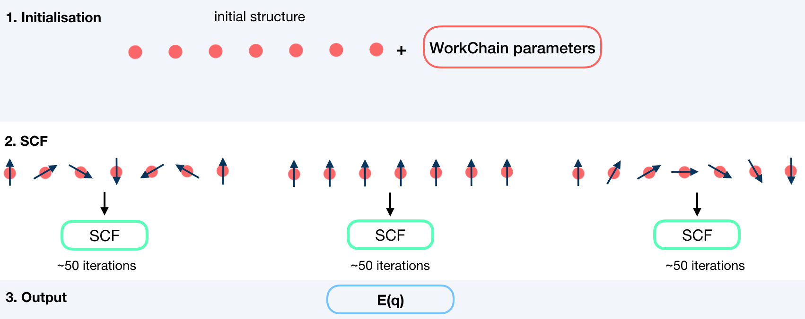

.. _ssdisp_conv_wc:

Fleur Spin-Spiral Dispersion Converge workchain
-----------------------------------------------

* **Current version**: 0.2.0
* **Class**: :py:class:`~aiida_fleur.workflows.ssdisp_conv.FleurSSDispConvWorkChain`
* **String to pass to the** :py:func:`~aiida.plugins.WorkflowFactory`: ``fleur.ssdisp_conv``
* **Workflow type**: Scientific workchain, self-consistent subgroup
* **Aim**: Calculate spin-spiral energy dispersion over given q-points converging all the q_points.

.. contents::
    :depth: 2

Import Example:

.. code-block:: python

    from aiida_fleur.workflows.ssdisp_conv import FleurSSDispConvWorkChain
    #or
    WorkflowFactory('fleur.ssdisp_conv')

Description/Purpose
^^^^^^^^^^^^^^^^^^^
This workchain calculates spin spiral energy  dispersion over a given set of q-points.
Resulting energies do not contain terms, corresponding to DMI energies. To take into account DMI,
see the :ref:`dmi_wc` documentation.

In this workchain the force-theorem is employed which means the workchain converges
a reference charge density first
and then submits a single FleurCalculation with a ``<forceTheorem>`` tag. However, it is possible
to specify inputs to use external pre-converged charge density to use it as a reference.

The task of the workchain us to calculate the energy difference between two or several structures
having a different magnetisation profile:

.. image:: images/ssdisp_energies.png
    :width: 60%
    :align: center

To do this, the workchain employs the force theorem approach:

.. _exposed: https://aiida.readthedocs.io/projects/aiida-core/en/latest/working/workflows.html#working-workchains-expose-inputs-outputs

Input nodes
^^^^^^^^^^^

The FleurSSDispWorkChain employs
`exposed`_ feature of the AiiDA, thus inputs for the nested
:ref:`SCF<scf_wc>` workchain should be passed in the namespace
``scf``.

+-----------------+-----------------------------+---------------------------------+----------+
| name            | type                        | description                     | required |
+=================+=============================+=================================+==========+
| scf             | namespace                   | inputs for nested SCF WorkChain | yes      |
+-----------------+-----------------------------+---------------------------------+----------+
| wf_parameters   | :py:class:`~aiida.orm.Dict` | Settings of the workchain       | no       |
+-----------------+-----------------------------+---------------------------------+----------+

Workchain parameters and its defaults
.....................................

``wf_parameters``
,,,,,,,,,,,,,,,,,

``wf_parameters``: :py:class:`~aiida.orm.Dict` - Settings of the workflow behavior. All possible
keys and their defaults are listed below:

.. literalinclude:: code/ssdisp_conv_parameters.py

**beta** is a python dictionary containing a ``key: value`` pairs. Each pair sets **beta** parameter
in an inp.xml file. ``key`` specifies the atom label to change, ``key`` equal to `'all'` sets all
atoms groups. For example,

.. code-block:: python

    'beta' : {'222' : 1.57079}

changes

.. code-block:: html

      <atomGroup species="Fe-1">
        <filmPos label="                 222">.0000000000 .0000000000 -11.4075100502</filmPos>
        <force calculate="T" relaxXYZ="TTT"/>
        <nocoParams l_relax="F" alpha=".00000000" beta="0.00000" b_cons_x=".00000000" b_cons_y=".00000000"/>
      </atomGroup>

to:

.. code-block:: html

      <atomGroup species="Fe-1">
        <filmPos label="                 222">.0000000000 .0000000000 -11.4075100502</filmPos>
        <force calculate="T" relaxXYZ="TTT"/>
        <nocoParams l_relax="F" alpha=".00000000" beta="1.57079" b_cons_x=".00000000" b_cons_y=".00000000"/>
      </atomGroup>

.. note::

      **beta** actually sets a beta parameter for a whole atomGroup.
      It can be that the atomGroup correspond to several atoms and **beta** switches sets beta
      for atoms
      that was not intended to change. You must be careful and make sure that several atoms do not
      correspond to a given specie.

**q_vectors** is a python dictionary (``key: value`` pairs). The ``key`` can be any string which
sets a label of the q-vector. ``value`` must be a list of 3 values: $$q_x, q_y, q_z$$.

Output nodes
^^^^^^^^^^^^^

  * ``out``: :py:class:`~aiida.orm.Dict` -  Information of
    workflow results like success, last result node, list with convergence behavior

    .. code-block:: python

        {
            "energies": {
                "label": 0.0,
                "label2": 0.014235119451769
            },
            "energy_units": "eV",
            "errors": [],
            "failed_labels": [],
            "info": [],
            "q_vectors": {
                "label": [
                    0.0,
                    0.0,
                    0.0
                ],
                "label2": [
                    0.125,
                    0.0,
                    0.0
                ]
            },
            "warnings": [],
            "workflow_name": "FleurSSDispConvWorkChain",
            "workflow_version": "0.1.0"
        }

    Resulting Spin Spiral energies are listed according to given labels.

.. _layout_ssdisp_conv:

Layout
^^^^^^^^^^^^^^^^^^^^^^^^^^^^^^

SSDisp converge always starts with a structure and a list of q-vectors to calculate. There is no
way to continue from pre-converged charge density.

Error handling
^^^^^^^^^^^^^^
A list of implemented :ref:`exit codes<exit_codes>`:

+------+------------------------------------------------------------------------------------------+
| Code | Meaning                                                                                  |
+======+==========================================================================================+
| 230  | Invalid workchain parameters                                                             |
+------+------------------------------------------------------------------------------------------+
| 340  | Convergence SSDisp calculation failed for all q-vectors                                  |
+------+------------------------------------------------------------------------------------------+
| 341  | Convergence SSDisp calculation failed for some q-vectors                                 |
+------+------------------------------------------------------------------------------------------+

Example usage
^^^^^^^^^^^^^

  .. literalinclude:: code/ssdisp_conv_wc_submission.py
