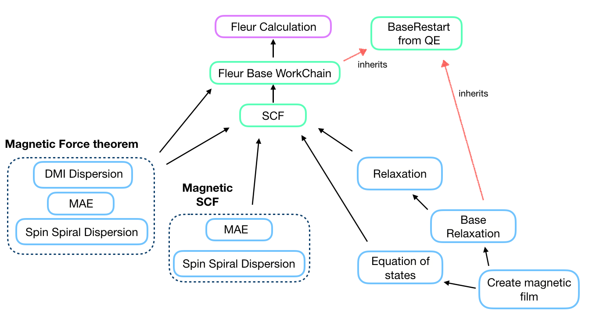

AiiDA-FLEUR WorkChains
======================

General design
++++++++++++++

All of the WorkChains have a similar interface and they share several common input nodes.

Inputs
------

There is always a ``wf_parameters``:
:py:class:`~aiida.orm.Dict` node for controlling the workflow behavior.
It contains all the parameters related to physical aspects of the
workchain and its content vary between different workchains.

.. note::

    ``inpxml_changes`` key of ``wf_parameters`` exists for most of the workchains.
    This list can be used to apply any
    supported change to inp.xml that will be used in calculations. To add a required change,
    simply append a two-element tuple where the first element is the name of the
    registration method and the second is a dictionary of inputs for the registration method. For
    more information about possible registration methods and their inputs see :ref:`fleurinp_mod`.
    An example:

    .. code-block:: python

        inpxml_changes = [('set_inpchanges', {'change_dict': {'l_noco': False}})]

The other common input is an ``options``: :py:class:`~aiida.orm.Dict` node
where the technical parameters (AiiDA options) are specified i.e resources, queue name and so on.

Regarding an input crystal structure, it can be set in two ways in the most of the workflows:

    1. Provide a ``structure``: :py:class:`~aiida.orm.StructureData` node
       and an optional ``calc_parameters``: :py:class:`~aiida.orm.Dict`.
       It this case an inpgen code node is required. The workflow will call inpgen calculation and
       create a new FleurinpData that will be used in the workchain.
    2. Provide a ``fleurinp``: :py:class:`~aiida_fleur.data.fleurinp.FleurinpData` node
       which contains a complete input for a FLEUR calculation.
    3. Provide a ``remote_data``: :py:class:`~aiida.orm.RemoteData` and
       the last charge density and ``inp.xml`` from the previous
       calculation will be used.

Input for the nested workchains has to be specified via a corresponding namespace. Please,
refer to the documentation of a particular workchain to see the details.

Outputs
-------
Most of the workchains return a workflow specific *ParameterData*
(:py:class:`~aiida.orm.Dict`) node named ``output_name_wc_para`` or simple ``out``
which contains the main results and some information about the workchain.

There are additional workflow specific input and output nodes, please read the
documentation of a particular workchain that you are interested in.

Workchain classification
++++++++++++++++++++++++

All of the workchains are divided into the groups. First, we separate *technical* and
*scientific* workflows. This separation is purely subjective: *technical* workchains tend to be
less complex and represent basic routine tasks that people usually encounter. *Scientific*
workflows are less general and aimed at certain tasks.

There are the sub-group of the force theorem calculations
and their self-consistent analogs in the scientific workchains group.

.. note::

    The ``plot_fleur`` function provides a quick visualization for every workflow node or node list.
    Inputs are *uuid*, *pk*, *workchain* nodes or *ParameterData* (workchain output) nodes.

Basic (Technical) Workchains
++++++++++++++++++++++++++++

.. toctree::
   :maxdepth: 2

   ./base_wc
   ./scf_wc
   ./eos_wc
   ./base_relax_wc
   ./relax_wc
   ./dos_band_wc
   ./orbcontrol_wc

More advanced (Scientific) Workchains
+++++++++++++++++++++++++++++++++++++

Advanced workchains can be divided into categories according to subject.

XPS workchains:

.. toctree::
   :maxdepth: 2

   ./initial_cls_wc
   ./corehole_wc

Magnetic workchains:

Magnetic workchains can be divided into two subgroups the Force-theorem subgroup and the self-consistent sub-group.

The Force-theorem subgroup contains:

- ssdisp_wc
- dmi_wc
- mae_wc

The self-consistent sub-group contains:

- ssdisp_conv_wc
- mae_conv_wc

.. toctree::
   :maxdepth: 2

   ./ssdisp_wc
   ./dmi_wc
   ./mae_wc
   ./ssdisp_conv_wc
   ./mae_conv_wc

And other workflows like the  create_magnetic_wc.

.. toctree::
   :maxdepth: 2

   ./create_magnetic_wc
   ./cfcoeff_wc
